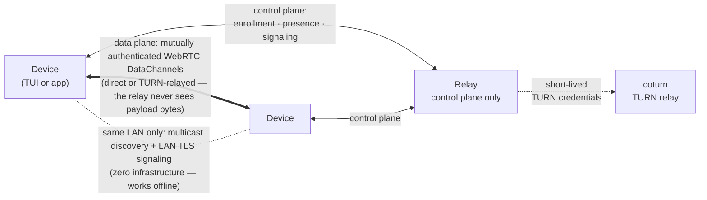

<p align="center">
  <picture>
    <source media="(prefers-color-scheme: dark)" srcset="docs/icon/heyaki-transparent.png">
    
  </picture>
</p>

<h1 align="center">Heyaki</h1>

<p align="center">
  <strong>Peer-to-peer communication infrastructure for devices — your data never rides a server.</strong><br>
  <a href="README.md">English</a> | <a href="README_zh.md">简体中文</a>
</p>

<p align="center">
  <a href="https://github.com/Linductor-alkaid/heyaki/actions/workflows/ci.yml"></a>
  <a href="https://github.com/Linductor-alkaid/heyaki/releases"></a>
  <a href="LICENSE"></a>
  
  
</p>

---

Heyaki lets applications on different devices find each other, authenticate, and
talk directly. Devices on the same LAN discover each other with **no server at
all**; devices across networks use a relay **only for the control plane** —
enrollment, presence, and signaling — while messages, files, and shells flow
**peer-to-peer over mutually authenticated WebRTC DataChannels**, with TURN as
the fallback path. The relay never sees user payload bytes.



## Highlights

| | |
| --- | --- |
| **Serverless LAN mode** | Signed multicast presence + LAN TLS signaling — two devices on one LAN discover, authenticate, and exchange data with zero infrastructure. |
| **Relay for reach, not for data** | The relay handles enrollment, endpoint presence, and signed signaling forwarding only; TURN REST credentials (coturn) are minted per session. Payloads stay P2P. |
| **Mutual authentication everywhere** | Ed25519 device identities, signed offers/answers/candidates with replay protection, session keys bound to verified signaling. Unknown peers are pairing-restricted by default. |
| **Five services on one session** | Messages (best-effort / peer-acked), unary RPC (deadlines, cancellation, `outcome_unknown` semantics), pub-sub events (keep-latest / reliable-live), resumable file transfer (BLAKE3-verified, atomic commit), and a default-off remote shell with a safe VT renderer. |
| **Password pairing & TrustGrants** | Argon2id-verified password pairing issues signed, scoped trust grants — effective scope is always the policy intersection. |
| **Bounded by construction** | Every queue, window, cache, and history ring has an explicit frozen cap; overload surfaces as admission errors or backpressure, never silent loss. All concurrency runs on the pinned `executor` — no ad-hoc threads. |
| **Production observability** | nearly 400 Prometheus metric families across device and relay, JSON Lines structured logs with correlation ids, 20 SLO alerts + Grafana dashboard, and a full operations runbook. |
| **Hardened supply chain** | Commit-pinned dependencies with verified SBOM (SPDX) and permissive-only license gates, secret & OSV vulnerability scanning in CI, PIE/RELRO/FORTIFY/CET hardening, and Ed25519 release-artifact signing. |

## Quick start

```sh
git clone https://github.com/Linductor-alkaid/heyaki && cd heyaki
scripts/fetch_third_party.sh --all   # synchronize pinned dependencies
cmake --preset release && cmake --build --preset release
```

Start a relay (TLS control plane on :8443):

```sh
openssl req -x509 -newkey rsa:2048 -nodes -days 3650 \
  -keyout relay.key -out relay.crt -subj "/CN=hey-relay" \
  -addext "subjectAltName=DNS:hey-relay"
cat > relay.conf <<'EOF'
listen_address = 0.0.0.0
listen_port = 8443
tls_certificate_file = relay.crt
tls_private_key_file = relay.key
database_file = relay.sqlite
EOF
build/release/install/bin/heyaki-relay --config relay.conf
```

Run the terminal client on each device (`build/release/install/bin/heyaki-tui`):
first run walks through local identity creation and optional relay enrollment,
then discover, pair, and connect — messages, files, and shells ride the P2P
session. Embedders use the C++20 library instead:

```cmake
find_package(heyaki CONFIG REQUIRED)
target_link_libraries(my_app PRIVATE heyaki::client heyaki::services)
```

Full walkthrough: [docs/getting-started.md](docs/getting-started.md) ·
API reference: [docs/api.md](docs/api.md) ·
linking Heyaki into your own app on Linux and Windows:
[docs/client-library.md](docs/client-library.md) (prebuilt SDK archives are
attached to every [release](https://github.com/Linductor-alkaid/heyaki/releases))

## Measured performance (v1 acceptance)

Loopback benchmarks from the CI harness (per-scenario P95, budgets in
[docs/operations/parameter-freeze.md](docs/operations/parameter-freeze.md)):

| Operation | Measured P95 | Acceptance budget |
| --- | --- | --- |
| Relay registration + login | 22–32 ms | < 2 s |
| Direct connect (hole punch) | 0.3–1.0 s | < 3 s |
| TURN fallback connect | 0.7–1.1 s | < 5 s |
| Message round-trip (1 KiB) | 0.3–4 ms | — |
| Unary RPC round-trip | 2.3–8.5 ms | — |
| Single-file transfer | 4–13 MiB/s | — |

24/72 h soak harnesses bound memory, file descriptors, sessions, and replay
caches across session/device churn and deliberate overload
([runbook](docs/operations/runbook.md)).

## Platform support

| | Linux (GCC 13+ / Clang) | Windows 10/11 (MSVC 2022) |
| --- | --- | --- |
| Client libraries & TUI | ✅ | ✅ |
| Relay server | ✅ (CI-verified platform) | ✅ (development) |
| ICE backend | vendored libjuice (TURN/UDP) or system libnice (TURN/UDP + TCP) | libjuice |
| NAT/fault/soak/bench matrices | ✅ CI (netns + coturn topologies) | ✅ CI (network matrix incl. firewall profiles) |
| Sanitizers (ASan/UBSan/TSan) | ✅ CI | — |

Cross-network topologies (symmetric NAT, CGNAT, UDP-blocked → TURN/TCP) are
exercised in CI with real coturn instances; see
[docs/operations/cross-os-matrix.md](docs/operations/cross-os-matrix.md) for
the full coverage map and known platform limits.

## Security

- Default-deny sessions; every wire object is canonically signed; parsers
  reject unknown fields (signature integrity).
- Pairing backoff, grant scoping, replay caches, and rate limits on every
  relay surface; eight-surface adversarial regression suite
  ([docs/security/m9-security-regression.md](docs/security/m9-security-regression.md),
  [threat model](docs/security/threat-model.md)).
- Fuzzing (libFuzzer) with a minimized regression corpus, protocol golden
  vectors, and crash-injection matrices for the file store.

## Documentation

Everything is indexed in [docs/README.md](docs/README.md) — architecture,
frozen wire protocol, deployment & operations runbook, configuration
reference, API reference, troubleshooting, compatibility policy, and the
[v1 release checklist](docs/operations/release-checklist-v1.md). The
engineering delivery record (milestones M0–M9) lives in
[docs/todolists/](docs/todolists/).

## Project status

**v1.0.0** — the full MVP→v1 roadmap (M0–M9) is complete: protocol & crypto,
runtime/identity, LAN serverless + relay control plane, WebRTC connectivity,
authorization/ByteStream, message/RPC, events/file transfer, remote shell, and
production hardening (observability, matrices, soak/bench, parameter freeze,
compatibility, fuzzing, supply chain, security regression, packaging, release
engineering). Release artifacts are built and verified by
[scripts/package_release.sh](scripts/package_release.sh) and signed per the
[signing procedure](docs/operations/release-signing.md).

## License

Heyaki is released under the [MIT License](LICENSE). Third-party dependencies
carry their own permissive licenses (MPL-2.0, ISC, BSL-1.0, MIT, …); every
license text ships in the release tarball and the SPDX SBOM lists the full
closure ([docs/supply-chain/dependency-policy.md](docs/supply-chain/dependency-policy.md)).
