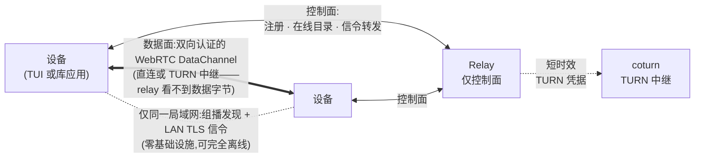

<p align="center">
  <picture>
    <source media="(prefers-color-scheme: dark)" srcset="docs/icon/heyaki-transparent.png">
    
  </picture>
</p>

<h1 align="center">Heyaki</h1>

<p align="center">
  <strong>面向设备的点对点通信基础设施 —— 你的数据从不经过服务器。</strong><br>
  <a href="README.md">English</a> | <a href="README_zh.md">简体中文</a>
</p>

<p align="center">
  <a href="https://github.com/Linductor-alkaid/heyaki/actions/workflows/ci.yml"></a>
  <a href="https://github.com/Linductor-alkaid/heyaki/releases"></a>
  <a href="LICENSE"></a>
  
  
</p>

---

Heyaki 让不同设备上的应用互相发现、完成认证并直接通信。同一局域网内的设备**完全不需要服务器**即可互相发现；跨网络的设备只把 relay 用在**控制面**——注册、在线目录与信令转发——而消息、文件与远程终端全部走**经双向认证的 WebRTC DataChannel 点对点直连**，打洞失败时回落 TURN 中继。relay 永远看不到用户数据的字节。



## 核心特性

| | |
| --- | --- |
| **无服务器局域网模式** | 签名组播 presence + LAN TLS 信令——同一局域网内的两台设备在零基础设施下完成发现、认证与数据交换。 |
| **relay 只管可达，不经手数据** | relay 只负责注册、endpoint 在线目录与签名信令转发；TURN REST 凭据（coturn）按会话签发。业务数据始终点对点。 |
| **全链路双向认证** | Ed25519 设备身份、带重放保护的签名 offer/answer/candidate、绑定已验证信令的会话密钥。未知设备默认进入仅配对受限状态。 |
| **一个会话，五类服务** | 消息（best_effort / peer_acked）、一元 RPC（截止时间、协作取消、`outcome_unknown` 语义）、发布订阅事件（keep-latest / reliable-live）、可断点续传的文件传输（BLAKE3 校验、原子提交）、默认关闭的远程 Shell（内置安全 VT 渲染器）。 |
| **密码配对与 TrustGrant** | Argon2id 校验的密码配对签发带 scope 的签名信任凭证——实际授权永远是策略交集。 |
| **天然有界** | 每个队列、窗口、缓存与历史环都有显式冻结上限；过载表现为准入错误或背压，绝不静默丢失。全部并发运行在 pinned 的 `executor` 上——没有野生线程。 |
| **生产级可观测** | 设备与 relay 共近 400 个 Prometheus 指标族、带关联 ID 的 JSON Lines 结构化日志、20 条 SLO 告警 + Grafana 面板、完整运维 runbook。 |
| **加固的供应链** | commit 级 pin 的依赖 + 校验过的 SPDX SBOM 与仅许可式许可证门禁、CI 内 secret/OSV 漏洞扫描、PIE/RELRO/FORTIFY/CET 编译加固、Ed25519 发布制品签名。 |

## 快速开始

```sh
git clone https://github.com/Linductor-alkaid/heyaki && cd heyaki
scripts/fetch_third_party.sh --all   # 同步 pinned 依赖
cmake --preset release && cmake --build --preset release
```

启动一个 relay（TLS 控制面，端口 8443）：

```sh
openssl req -x509 -newkey rsa:2048 -nodes -days 3650 \
  -keyout relay.key -out relay.crt -subj "/CN=hey-relay" \
  -addext "subjectAltName=DNS:hey-relay"
cat > relay.conf <<'EOF'
listen_address = 0.0.0.0
listen_port = 8443
tls_certificate_file = relay.crt
tls_private_key_file = relay.key
database_file = relay.sqlite
EOF
build/release/install/bin/heyaki-relay --config relay.conf
```

在每台设备上运行终端客户端（`build/release/install/bin/heyaki-tui`）：
首次运行引导完成本地身份创建与可选的 relay 注册，之后即可发现、配对、
建连——消息、文件与远程终端都跑在 P2P 会话上。嵌入方使用 C++20 库：

```cmake
find_package(heyaki CONFIG REQUIRED)
target_link_libraries(my_app PRIVATE heyaki::client heyaki::services)
```

完整流程见 [docs/getting-started.md](docs/getting-started.md)（英文）·
API 参考：[docs/api.md](docs/api.md)（英文）·
在 Linux 与 Windows 上把 Heyaki 接入你自己的应用：
[docs/client-library.md](docs/client-library.md)（英文；每个
[Release](https://github.com/Linductor-alkaid/heyaki/releases) 均附带预构建
SDK 包）

## 实测性能（v1 验收）

来自 CI 基准 harness 的环回实测（各场景 P95；验收预算见
[docs/operations/parameter-freeze.md](docs/operations/parameter-freeze.md)）：

| 操作 | 实测 P95 | 验收预算 |
| --- | --- | --- |
| relay 注册 + 登录 | 22–32 ms | < 2 s |
| 直连建连（打洞） | 0.3–1.0 s | < 3 s |
| TURN 回落建连 | 0.7–1.1 s | < 5 s |
| 消息往返（1 KiB） | 0.3–4 ms | — |
| 一元 RPC 往返 | 2.3–8.5 ms | — |
| 单文件传输 | 4–13 MiB/s | — |

24/72 小时长稳 harness 在会话/设备轮转与刻意过载下钉死内存、文件描述
符、会话表与重放缓存的有界性（[runbook](docs/operations/runbook.md)）。

## 平台支持

| | Linux（GCC 13+ / Clang） | Windows 10/11（MSVC 2022） |
| --- | --- | --- |
| 客户端库与 TUI | ✅ | ✅ |
| relay 服务端 | ✅（CI 验证平台） | ✅（开发用途） |
| ICE 后端 | 内置 libjuice（TURN/UDP）或系统 libnice（TURN/UDP+TCP） | libjuice |
| NAT/故障/长稳/基准矩阵 | ✅ CI（netns + coturn 拓扑） | ✅ CI（网络矩阵，含防火墙 profile） |
| Sanitizer（ASan/UBSan/TSan） | ✅ CI | — |

跨网络拓扑（symmetric NAT、CGNAT、UDP 全封 → TURN/TCP）在 CI 中以真实
coturn 实例验证；完整覆盖图与已知平台限制见
[docs/operations/cross-os-matrix.md](docs/operations/cross-os-matrix.md)。

## 安全

- 默认拒绝（default-deny）会话；线上每个对象都规范签名；解析器拒绝未
  知字段（签名完整性）。
- 配对退避、授权范围、重放缓存与 relay 全表面限速；八攻击面对抗回归
  套件（[docs/security/m9-security-regression.md](docs/security/m9-security-regression.md)、
  [威胁模型](docs/security/threat-model.md)）。
- libFuzzer 持续模糊测试 + 最小化回归语料 + 协议 golden vectors + 文件
  存储崩溃注入矩阵。

## 文档

全部文档索引于 [docs/README.md](docs/README.md)——架构、冻结的 wire
协议、部署与运维 runbook、配置参考、API 参考、故障排查、兼容性策略与
[v1 发布清单](docs/operations/release-checklist-v1.md)。工程交付记录
（里程碑 M0–M9）见 [docs/todolists/](docs/todolists/)。

## 项目状态

**v1.0.0** —— MVP→v1 的完整路线图（M0–M9）已全部完成：协议与加密、运行
时/身份、LAN 无服务器 + relay 控制面、WebRTC 连通、授权/ByteStream、消
息/RPC、事件/文件传输、远程 Shell，以及生产加固（可观测、全矩阵、长稳/
基准、参数冻结、兼容性、模糊测试、供应链、安全回归、打包、发布工程）。
发布制品由 [scripts/package_release.sh](scripts/package_release.sh) 构建
并验证，按[签名规程](docs/operations/release-signing.md)签名。

## 许可证

Heyaki 以 [MIT License](LICENSE) 发布。第三方依赖各自携带宽松许可证
（MPL-2.0、ISC、BSL-1.0、MIT 等）；全部许可文本随发布包附带，SPDX SBOM
记录完整闭包
（[docs/supply-chain/dependency-policy.md](docs/supply-chain/dependency-policy.md)）。
