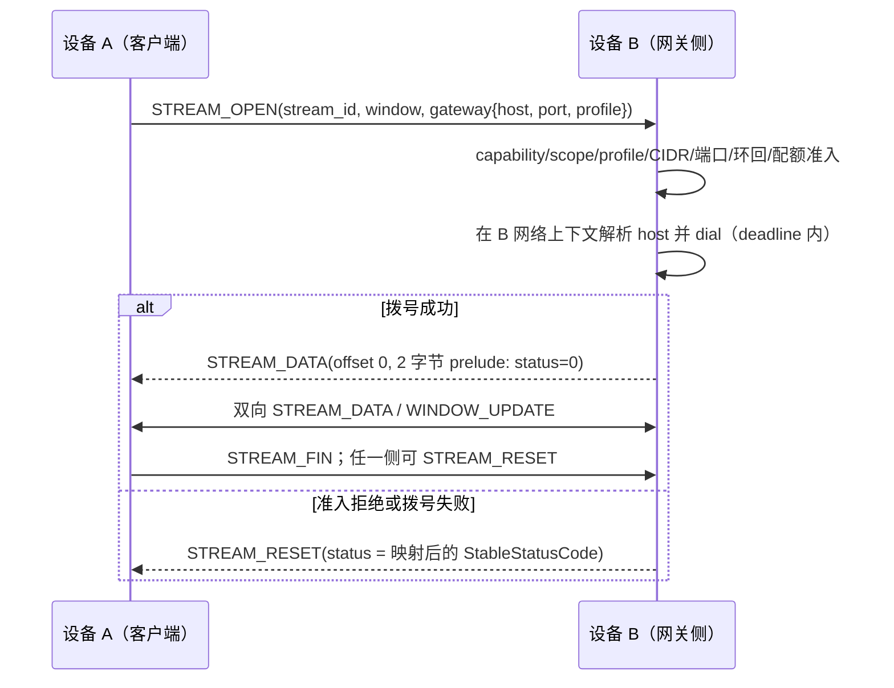

# Gateway 代理服务设计

> 状态：设计基线（M10 立项依据，未实施）
> 日期：2026-08-27
> 目标版本：protocol 1.3 / M10（v1.x，不进入 v1.0 发布门禁）
> 上位设计：[Heyaki 设备通信基础设施设计](heyaki-architecture.md) §8.6、[Wire Protocol v1](heyaki-wire-protocol.md)

## 1. 背景与范围

需求：已建立认证会话的两台设备 A、B 中，A 借助 B 访问 B 所在并已连接的其他网络中的节点，
或经 B 访问公网。

本设计交付"受限应用层网关"形态：B 作为 A 的 L4 字节流代理。A 与 B 之间复用既有认证
WebRTC 会话与 ByteStream 原语，B 侧在准入与授权通过后于本机网络上下文中发起连接并双向
搬运字节。gateway 流量对 relay 与 coturn 仍只是 DTLS 密文，不改变 relay 的任何语义。

明确不做：

- **Heyaki 会话多跳转发**（A 经 B 与第三台 Heyaki 设备 C 建立会话）：架构 §2.2 非目标。
  A 访问另一台 Heyaki 设备 C 应使用 A 自身的 LAN/relay 路由直连；gateway 只面向 B 网络内
  的非 Heyaki 目标与公网出口。
- **L3 透明路由 / TUN / 通用 VPN**：架构 §2.2 非目标，保留为计划 `POST-11`。该形态需要
  架构非目标条目修订、特权部署与独立安全里程碑，不在本设计范围内。
- **UDP 转发**（含 SOCKS5 UDP ASSOCIATE 与数据报流）：保留为计划 `POST-12`，首版仅 TCP。
- **透明 DNS 接管**：L4 模式下域名由 B 侧代理解析（见 §4.3），不提供网关侧透明 DNS。

## 2. 术语与拓扑

```text
设备 A（客户端侧）                     设备 B（网关侧）
  应用 / SOCKS5 前端                     GatewayService
      | open_gateway_stream                  | 准入 + profile 裁决
      v                                       v
  PeerSession -- heyaki.gateway.<id> 通道 -- PeerSession
      |                                       | 本地 dial（B 网络上下文）
      v                                       v
  ByteStream（STREAM_* 帧）               目标 host:port
                                          （B 的 LAN 子网节点或公网）
```

- **gateway profile**：B 本地配置的受限目标集合与配额（§3.2），是授权裁决的输入之一。
- **prelude**：网关侧在拨号成功后发送的首个 `STREAM_DATA` 状态前导（§4.2）。
- **gateway 流**：一条由 `STREAM_OPEN` 的 `gateway` 字段建立的 ByteStream，对应 B 侧一条
  本地 TCP 连接。

## 3. 能力模型与授权

### 3.1 Scope 与 TrustGrant

- 发起方 A 的 TrustGrant 必须包含 `gateway.use`；提供方 B 必须持有（本地配置或管理员
  签发的）`gateway.provide:<profile>` 能力。
- 两者均**默认关闭**，不进入任何标准 pairing 模板（只读/文件/维护模板同步排除，与
  Remote Shell 同等对待）。用户可以显式配置 full-access 或自定义模板，但界面必须展示
  其影响。
- 最终裁决沿用架构 §5.5 的交集模型：连接方请求 ∩ A 的 TrustGrant scope ∩ B 的
  gateway profile ∩ B 本地服务策略。任何一项不满足即拒绝，拒绝原因使用稳定错误码。

### 3.2 Gateway profile

每个 profile 显式声明（配置非法时启动失败，不允许静默回退到宽松值）：

| 字段 | 约束 |
| --- | --- |
| CIDR 允许列表 | 显式枚举的目标网段；`0.0.0.0/0` 或 `::/0` 仅在 `allow_internet` 显式开启时有效 |
| 端口/端口范围 allowlist | 空列表表示拒绝全部 |
| `allow_internet` | 默认 `false`；默认模板仅允许 B 的直连网段 |
| 并发流上限 | 每 session 与每 profile 双重限制 |
| 字节/速率配额 | 按 profile 聚合计量与执行 |
| 每流空闲超时与总时长上限 | 超时 reset 该流并计数 |
| dial deadline | 默认 10 秒，上限 30 秒 |
| 人工确认模式 | `never` / `first_use` / `always`（见 §3.3） |

### 3.3 同意流与审计

- B 侧按 profile 配置执行人工确认：TUI 显示对端 `DeviceId`、目标范围（profile 名与
  CIDR 摘要）与请求时长，用户允许/拒绝；`first_use` 的决定可按对端持久化进本地策略。
- 审计记录：对端 `DeviceId`、profile、目标 `host:port`、开始/结束时间、双向字节数、
  结束原因。目标 `host` 是远端输入，必须先通过 §10 的 hostname/IP 字面量校验才可进入
  日志，非法值以稳定 token 替换（`safe_detail` 纪律，threat-model §3）。

## 4. 协议设计（protocol 1.3）

### 4.1 变更范围

protocol 1.3 只包含以下 minor 变更，全部走 wire protocol §4 文档化的 minor 路径，
**不新增任何帧类型**（帧数值表在 1.2 后已封死）：

1. 新 capability bit `gateway_v1`（bit 13），要求 negotiated minor ≥ 3。1.0-1.2 对端
   不会置位；协商交集为空时不启用任何 gateway 行为。
2. `heyaki.protocol.stream.v1.StreamOpen` 新增可选字段
   `heyaki.protocol.gateway.v1.GatewayConnect gateway = 4;`。旧实现在语义上将其视为
   普通 `STREAM_OPEN` 的未知可选字段（proto3 跳过）；1.3 实现必须在未协商出 bit 13 时
   拒绝携带该字段的 `STREAM_OPEN` 并以 `protocol` 关闭对应通道。
3. 新 schema 包 `proto/heyaki/gateway/v1/gateway.proto`
   （`heyaki.protocol.gateway.v1`），按协议 schema 政策源文件权威、生成物不入库：

   ```protobuf
   message GatewayConnect {
     bytes host = 1;      // ASCII 主机名（LDH）或 IPv4/IPv6 字面量，1-253 字节
     uint32 port = 2;     // 1-65535
     string profile = 3;  // 可选 profile 名，ASCII [a-z0-9_.-]，1-64 字节
   }
   ```

### 4.2 打开流程与 prelude



- **prelude**：网关侧拨号成功后发送的首个 `STREAM_DATA` 帧固定为 2 字节载荷
  （U16 big-endian `StableStatusCode`，`0` = connected），此前不得发送任何载荷字节。
  prelude 计入该方向的普通字节流（offset 0-1），后续数据从 offset 2 继续。
- 拨号失败或准入拒绝时**不发 prelude**，直接 `STREAM_RESET`，`status` 使用 1.3 变更单
  冻结的错误映射表（permission_denied、unreachable、timeout、resource_exhausted 等
  既有 `StableStatusCode` 值；dial 细分原因合并为粗粒度值，见 §9.2）。
- 客户端 API 在收到 status=0 的 prelude 前不得向调用方报告"已连接"；deadline 到期返回
  `timeout` 并发送 `STREAM_RESET`。
- 帧与通道：每个活跃 gateway 连接使用一个非零逻辑通道 `heyaki.gateway.<id>`，通道域为
  stream/gateway，不得改作其他业务域。

### 4.3 域名解析归属

`GatewayConnect.host` 可以是主机名。域名**始终由 B 侧解析**：

- A 侧 SOCKS5 前端收到域名目标（ATYP=0x03）时必须原样透传，不得本地解析——这使 A 能
  使用 B 网络的内部域名（split-DNS 的自然替代），也保证解析发生在有授权与审计的一侧。
- B 侧解析结果仍必须逐条通过 profile 的 CIDR/管理网段检查后才可拨号（解析后校验，不是
  仅校验字面量）。

### 4.4 状态机与恢复语义

- 完全复用 wire protocol §6.3 的 stream 状态机：方向独立 offset 严格递增、接收字节与
  帧双重窗口、`STREAM_FIN`/`STREAM_RESET`、按认证 `(SessionId, SessionEpoch)` 隔离迟到
  数据、不跨重连自动恢复（M5-18 语义）。
- session restart（protocol 1.2）后旧 gateway 流随旧 epoch 失效；A 侧 API 对调用方暴露
  断流错误，SOCKS5 前端关闭对应本地 TCP 连接，不假装无损迁移。

## 5. 设备端结构

```text
proto/heyaki/gateway/v1/gateway.proto        # GatewayConnect（1.3 变更单冻结）
src/services/gateway/
  gateway_service.{hpp,cpp}                   # B 侧：准入、dial、字节搬运
  gateway_client.{hpp,cpp}                    # A 侧：open_gateway_stream
  socks_frontend.{hpp,cpp}                    # A 侧可选：SOCKS5 CONNECT 前端
```

- 依赖方向遵守 services -> 会话抽象 -> transport SPI；gateway 类型不出现在 transport 层
  公共头文件。
- **A 侧库 API**：
  `Result<ByteStream> open_gateway_stream(DeviceId peer, HostPort target, Deadline d)`，
  复用公共 Result/错误码/cancellation 语义；返回的流就是普通 `ByteStream`。
- **SOCKS5 前端**（可选便利层，不进核心库依赖闭包）：
  - 用户态 TCP 监听，默认仅绑定 loopback（如 `127.0.0.1:1080`），零特权；
  - 仅实现 SOCKS5 `CONNECT`（TCP）；域名目标原样透传（§4.3）；
  - 不支持 no-auth 之外的认证方式扩展由部署策略决定，前端凭据与 Heyaki 身份无关；
  - 前端与 Heyaki 会话同进程时通过公共 API 工作，不引入私有协议（TUI 共存规则同 §12.4）。
- **TUI**：新增 Gateway 视图（架构 §12.2）。B 侧提供请求同意/拒绝、profile 管理、活跃
  连接与字节审计；A 侧发起 gateway、查看 prelude 延迟/路径/配额与 SOCKS 前端状态。

## 6. 并发、背压与关闭

- B 侧本地 dial 的 socket、A 侧 SOCKS 前端的 acceptor/dial，全部是现有 executor 托管
  Asio runtime 上的普通 async 对象；不创建第二 worker、裸线程或独立 poll loop
  （计划 `EXEC-02`/`EXEC-10` 已确立的模式）。
- 隧道↔本地 socket 的字节搬运使用有界缓冲，容量纳入既有发送/接收队列限额。满载策略为
  **reset 该 gateway 流并计数**：与可靠业务帧的默认拒绝不同，这是 gateway 显式选择的
  drop 语义，必须在配置中显式、在指标中可观测，不允许静默丢失。
- 加权调度中 gateway 通道权重与 file 同级或更低：control/Shell > RPC/message >
  event/file ≥ gateway（扩展 M5-04 调度表并以同一 benchmark 验证不饥饿）。
- 关闭顺序沿用架构 §11.1：gateway 活跃流在"取消服务"阶段被 reset（携带稳定
  status），本地 socket 随之关闭并回收，不产生 detached 工作。

## 7. 路径策略与计量

- 数据路径退化为 TURN 时，gateway 流量消耗 coturn 带宽且吞吐/延迟受中继限制。
  `PeerPathPolicy` 增加 `gateway_paths` 约束（默认允许当前仲裁路径；可配置为仅允许
  direct 路径或 TURN 路径限速），并在 TUI 中可见。
- 指标（并入架构 §13.2）：活跃 gateway 流数、准入结果分布（按拒绝原因）、按 profile 的
  字节/速率、TURN 路径上的 gateway 字节占比、dial P95（prelude 延迟）。

## 8. 限制与默认值

并入 `heyaki::Limits`，协商只能减小、本地硬上限不可被对端广告提高：

| 限制 | 默认 | 硬上限 |
| --- | ---: | ---: |
| 每 session 并发 gateway 流 | 8 | 64 |
| `host` 长度 | 253 字节 ASCII（LDH 或 IP 字面量；禁止 NUL/控制字符/空格/underscore 开头等非法形式） | 253 |
| profile 名 | 64 字节 `ASCII [a-z0-9_.-]` | 64 |
| 每 endpoint 配置 profile 数 | 16 | 64 |
| dial deadline | 10 秒 | 30 秒 |
| prelude | 固定 2 字节 | 2 |

## 9. 安全分析（threat model 增补条目，随 M10 评审合入）

1. **授权 gateway 等价于把 A 放进 B 的防火墙内侧**。A 可横向接触 profile 允许的 B 网络
   目标，其风险高于单机 Remote Shell。缓解：最小 CIDR、默认 `allow_internet=false`、
   人工确认、配额与全程审计；与 `shell.open` 同时授权时建议 profile 互斥或要求显式确认。
2. **B 视角的 SSRF**：`host` 可指向环回、链路本地、B 自身管理网段或隧道端点。B 侧必须
   维护默认 deny 列表（仿 coturn denied-peer-ranges，含 B 自身 Heyaki 控制/信令端口），
   且在 DNS 解析后逐地址校验；dial 目标解析为与 A 的隧道自身端点时拒绝（防环回）。
3. **端口扫描与探测 oracle**：A 可经 gateway 对 B 网段做连接探测。缓解：统一粗粒度错误
   映射（不区分 refused/unreachable/filtered）、每 host 尝试速率限制、配额与审计告警。
4. **公网出口滥用**：A 借 B 出口的行为在公网呈现为 B 的地址。默认关闭公网；开启时配额、
   审计与随时撤销。
5. **信息泄漏**：错误与日志不包含目标 host 自由文本（未过校验则以 token 替换）、不包含
   B 网络拓扑；prelude 之外无网关侧元数据帧。
6. **relay 视角不变**：gateway 不改变 relay 控制面语义（§1.2"relay never decodes"）；
   TURN 路径上仅见密文与流量计量。
7. **资源耗尽**：并发流、每流缓冲、profile 配额、dial deadline 全部有界；满载
   fail-closed 拒绝并计数，不静默驱逐。

## 10. 测试与验收

- **单元**：准入矩阵（scope/profile/CIDR/端口/环回/管理网段/配额）、`host` 校验、
  prelude 编解码、错误映射表、profile 配置非法启动失败。
- **协议**：1.3 golden vectors（`StreamOpen`+`gateway` 字段字节、prelude 帧、reset
  映射）；1.2 及更旧对端互通回归（未知字段跳过、未协商 bit 13 时携带 gateway 字段被
  `protocol` 拒绝）。
- **集成（netns）**：A（网段 1）—B（网段 1+2）—目标（网段 2）三段拓扑；B 出公网路径；
  强制 TURN 数据路径下的行为与计量。
- **安全**：无 scope/CIDR 外/管理网段/环回目标全部默认拒绝且可观测；扫描速率限制生效；
  审计内容不含未校验自由文本；配额满载 fail-closed；旧 epoch 迟到流被隔离。
- **性能**：gateway 满载时 control/Shell 延迟达标（复用 M5 公平性 benchmark）；dial P95
  在预算内。
- **SOCKS5 前端**：curl/浏览器经前端端到端；域名由 B 解析（B 网络 split-DNS 场景验证）；
  断流时本地 TCP 连接被关闭。

## 11. 里程碑

任务清单见 [m10-gateway-proxy.md](../todolists/m10-gateway-proxy.md)。L3/TUN 网关与
UDP 转发的延后项见计划 `POST-11`/`POST-12`。
