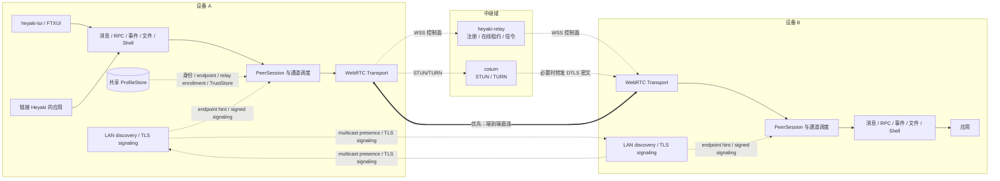
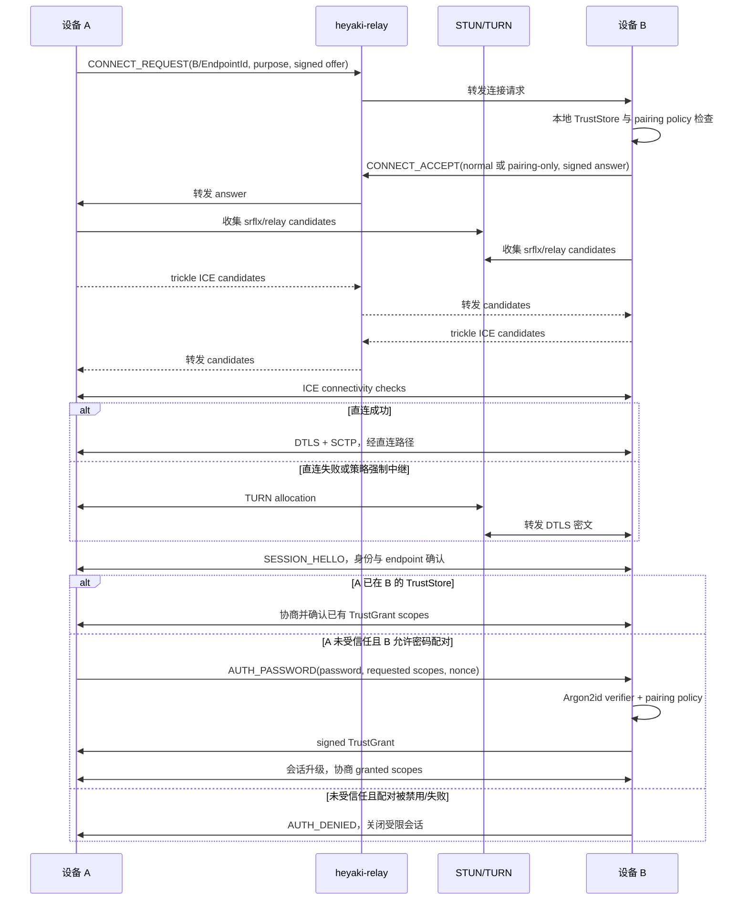

# Heyaki 设备通信基础设施设计

> 状态：架构设计修订版（授权密码、自动登录、LAN 无服务器连接、`heyaki-tui`、Gateway 代理服务与 Android（NDK）适配）
> 日期：2026-08-27（2026-08-29 增补 M11 Android 适配范围，见 §2.1；2026-08-31 M7 事件/文件
> 落地：§8.3/§8.4 所述语义按冻结 wire 协议交付，事件订阅作用域为 event.subscribe:<root>，
> manifest 逻辑名首段为接收根选择器，pull 以 heyaki.file/pull unary RPC 承载）
> 目标版本：MVP 至 v1
> 适用范围：设备端 C++20 库、`heyaki-tui`、注册/信令服务、NAT 穿透与中继服务

## 1. 摘要

Heyaki 是面向设备间通信的 C++ 基础设施库，并提供名为 `heyaki-tui` 的可直接使用的 FTXUI 终端程序。名称取自打招呼的声音 “heya”，并将 “kit” 的 `t` 隐去，与前缀组成 “aki”。它提供设备发现与连接、消息、双向字节流、文件传输、远程 Shell、RPC、远程事件总线，以及
默认关闭的受限 Gateway 代理服务：已授权设备可以将对端作为应用层网关，访问对端网络内
允许的目标或经对端出公网。同一局域网中的设备应能在没有中心服务器时自主发现并建立直连；跨 NAT 或受限网络则优先建立端到端直连，并在直连失败时自动切换到中继。

系统采用“轻控制面、端到端数据面”原则：

- 控制面由可组合的 LAN 与 relay 路径组成：LAN 路径负责本地发现和设备间信令，relay 路径负责注册、广域 presence、信令、NAT 穿透辅助和密文字节转发。
- 身份校验、授权、RPC 分派、事件订阅、文件协议和远程执行都在设备端完成。
- 中继不解析业务载荷，不执行 RPC，不保存离线消息，也不充当事件 Broker。
- LAN、P2P 和中继是同一逻辑会话的不同发现、信令或数据路径，业务 API 不感知当前路径。
- 设备在首次本地初始化时设置授权密码；其他设备可用该密码完成首次配对，随后使用设备公钥身份自动认证。
- `heyaki-tui` 与链接 Heyaki 的应用共享本机 profile；本地身份只创建一次，relay enrollment 为可选的后续能力。

首版推荐采用：

- `libdatachannel` 提供 ICE、DTLS、SCTP DataChannel 和 NAT 穿透客户端能力；
- Heyaki 自有的有界 UDP multicast 提供同一局域网发现，Boost.Asio TLS/TCP 提供本地签名信令；
- `coturn` 提供标准 STUN/TURN 服务；
- 自研轻量 `heyaki-relay` 通过 WSS 提供注册、在线租约和 WebRTC 信令；
- Protobuf Lite 定义控制协议和内建服务协议；
- Ed25519 稳定设备身份与签名后的信令绑定，防止 LAN/relay 信令路径替换 DTLS 指纹；
- C++20、CMake、Boost.Asio/Beast 构建设备生命周期和服务端控制面；
- 仓库已有 `executor` 用于业务处理、阻塞 I/O 和跨线程有界通信；FTXUI 用于正式的全功能 `heyaki-tui`。

这条路线优先复用成熟的 ICE/TURN、拥塞控制和可靠传输实现。自研 UDP 可靠协议或 TURN 子集的短期代码量看似较小，但会把 NAT 兼容性、重传、拥塞、安全和跨平台问题永久带入项目核心，因此不作为生产路线。

## 2. 目标与边界

### 2.1 功能目标

1. 设备在本地生成稳定身份，不依赖 relay enrollment 即可作为 Heyaki peer 运行。
2. 同一局域网设备无需中心服务器即可自主发现 endpoint、交换认证信令并建立 DataChannel。
3. 已授权设备可以按 `DeviceId` 发起连接，不依赖固定 IP 或端口；跨网连接通过可选 relay presence 定位。
4. 优先尝试 IPv6、局域网和公网 UDP 直连；失败且 relay/TURN 可用时使用 TURN 中继。
5. 同一设备会话承载多个相互隔离的逻辑通道。
6. 提供消息、RPC、事件、文件和远程 Shell 等设备端服务。
7. 全链路具备有界队列、流控、超时、取消、错误分类和可观测性。
8. 支持 Linux 和 Windows，保留 macOS 及受限嵌入式平台的扩展空间；Android（NDK，
   C++20 库 + JNI 集成层，不含 TUI/fuzzer/coturn 组件）作为 v1.x 后续目标
   （计划 M11），v1.0 发布门禁不因 Android 未交付而阻塞。
9. 设备本地初始化时设置授权密码，未知设备验证该密码后获得目标设备授予的持久信任。
10. 已登记设备后续启动时自动完成 relay 身份认证与重连，不再次要求用户输入注册凭据。
11. 提供覆盖所有 Heyaki 能力的 `heyaki-tui`，并允许库应用复用其创建的设备档案。
12. 已授权设备可以请求将对端作为受限应用层网关：经对端的已认证会话，以字节流代理形态
    访问对端 gateway profile 允许的 TCP 目标（对端所在网络的节点或经对端出公网）。该
    能力默认关闭、范围显式受限、全程审计，且不创建虚拟网卡或透明 IP 路由。

### 2.2 非目标

- 不实现通用 VPN、三层虚拟网络或透明 IP 路由。受限的应用层 Gateway 代理服务（§8.6）
  不属于此类：它只提供显式授权的字节流代理，不创建虚拟网卡、不接管路由表；L3/TUN
  网关形态仍为延后项（计划 `POST-11`），须先修订本条非目标并单独安全立项。
- 不保证任意 NAT 下均可直连。对称 NAT、运营商级 NAT、UDP 禁止和企业代理场景必须依靠中继。
- 不保证跨 VLAN、路由子网、阻止 multicast 的网络或启用 AP client isolation 的 Wi-Fi 能够无服务器发现/直连。
- 不提供离线消息、持久化事件、全局有序广播或“恰好一次”投递。
- 不让中继成为 RPC 网关、文件服务器、Shell 跳板机或业务授权中心。
- 不向 relay 上传或保存设备授权密码明文；授权密码由目标设备端验证。
- 不允许任意设备仅凭“已注册”就获得远程执行权限。
- v1 不支持设备间多跳转发；A 到 C 的流量不能默认经 B 路由。访问另一台 Heyaki 设备 C
  应使用 A 自身的 LAN/relay 路由直连；Gateway 代理服务只面向对端网络内的非 Heyaki
  目标与公网出口，不转发 Heyaki 会话。

### 2.3 设计原则

- **身份独立于地址**：设备身份来自长期公钥，IP、端口和中继实例均可变化。
- **端到端鉴权**：LAN TLS 或设备到 relay 的 TLS 只保护控制链路，设备会话还必须用长期设备身份相互认证。
- **一次初始化、可选登记**：首次本地初始化创建设备身份和授权策略；relay enrollment 是扩展可达范围的可选步骤，后续连接由长期设备密钥自动认证。
- **密码只用于首次配对**：授权密码换取的是受范围限制的持久信任，不作为每个 RPC 或文件块的口令。
- **路径透明**：业务层只面对 `PeerSession` 和 `Channel`，不分支处理 LAN/relay/TURN。
- **显式语义**：可靠、有序、确认、持久化和可重试不能混为一谈。
- **有界资源**：发送队列、接收窗口、并发 RPC、文件配额和 Shell 数量都必须有限制。
- **故障优先设计**：断线、重复、超时、部分写入和不确定执行结果是正常状态，而非异常边角。
- **服务端克制**：可以由设备协商和执行的行为，不增加到中继。
- **发现不等于信任**：multicast presence、源 IP、TLS 建连和 relay presence 都只能提供路由 hint，不能授予业务权限。
- **按需成网**：自动发现不意味着全量自动建连，只对已信任且策略允许的 peer 建立所需 session。

## 3. 技术路线分析

### 3.1 候选路线

| 路线 | NAT/中继成熟度 | 流与多路复用 | 实现成本 | 主要问题 | 结论 |
| --- | --- | --- | --- | --- | --- |
| WebRTC DataChannel + ICE/TURN | 高，标准化且部署经验多 | SCTP 多 DataChannel，消息语义 | 中 | 依赖较多；文件需分块；同一 SCTP association 内仍需调度 | **推荐用于 MVP/v1** |
| ICE + QUIC + TURN | NAT 成熟，QUIC 数据面优秀 | 原生双向/单向流、流控和迁移 | 高 | ICE socket 与 QUIC packet I/O 集成复杂；TURN/TCP 路径验证成本高 | 作为后续可插拔后端评估 |
| 自定义 UDP 打洞 + 自研可靠协议/中继 | 只覆盖常见 NAT | 完全可控 | 表面低、长期极高 | NAT 边界、拥塞、重传、MTU、安全均需自研 | 不采用 |
| WireGuard/Tailscale 风格覆盖网 | 穿透和身份模型成熟 | 上层可直接使用 TCP/QUIC | 很高 | 实际上变成 VPN/控制平面产品，超出库的范围 | 不作为核心路线 |

### 3.2 为什么首版选择 WebRTC DataChannel

Heyaki 的困难不在“通过 socket 发出字节”，而在各种 NAT、防火墙和网络变化下建立一条可认证、可恢复的设备会话。ICE 已经定义了 host、server-reflexive 和 relay candidate 的收集、连通性检查、优先级与提名；STUN/TURN 则覆盖公网地址发现和中继。DTLS 提供端到端加密，SCTP DataChannel 提供可靠/不可靠、有序/无序的多路消息通道。

`libdatachannel` 为 C++ 提供较轻的 WebRTC DataChannel 实现，不需要浏览器或媒体管线。首版可以把工程精力放在 Heyaki 的身份、授权、服务协议、背压和恢复语义上，而不是复刻 ICE 和拥塞控制。

其限制是 DataChannel 为消息接口而非 POSIX 字节流。Heyaki 需要在设备端增加统一 framing、分块和字节流适配层，并根据 `bufferedAmount` 实施背压。该成本可控，且不会进入中继。

### 3.3 QUIC 的位置

QUIC 很适合文件和 Shell：原生流、多路流控、TLS 1.3 和连接迁移都优于在 DataChannel 上模拟字节流。但首版直接组合 ICE、TURN 与 QUIC，需要解决以下工程问题：

- QUIC 实现通常自行管理 UDP socket，而 TURN 会包装或转发数据报；
- TURN/TCP/TLS 会把 QUIC 数据报放入可靠字节流，正确性可实现，但丢包时会出现双重可靠传输和队头阻塞；
- candidate 切换、QUIC path validation、连接 ID 与会话恢复需要统一设计；
- C++ 生态中不同 QUIC 实现的构建、许可证和外部 packet I/O 能力差异较大。

因此核心接口必须保持 transport-neutral，但 v1 只交付 WebRTC 后端。只有在压测证明 SCTP 的吞吐、延迟隔离或大文件传输无法满足目标时，再以相同 `PeerSession`/`Channel` 契约增加 ICE + QUIC 后端。不要在 MVP 同时维护两套数据面。

### 3.4 为什么不自研 TURN 或可靠 UDP

“服务器仅转发数据”不等于“转发协议很简单”。一个可上线的中继还要处理分配生命周期、权限、nonce、认证、带宽配额、反射放大、端口耗尽、IPv4/IPv6、TCP/TLS fallback 和滥用控制。采用 coturn 并不会把业务逻辑放到服务器，它只是复用标准网络基础设施。

若产品最终必须交付单一可执行文件，可以在协议稳定后再评估嵌入 TURN 实现；首版不应以减少部署组件为由承担协议安全风险。

### 3.5 LAN 无服务器控制路径

局域网无服务器能力不是第二套数据面。设备通过有界 UDP multicast 发布签名 presence，使用
Boost.Asio TLS/TCP 直接交换经过长期设备密钥认证的信令，随后仍由 libdatachannel 使用 host
candidate 建立 DTLS/SCTP DataChannel。LAN 和 relay 只是 `DiscoveryProvider` 与
`SignalingRoute` 的不同实现，上层 `PeerSession`、授权和业务服务保持一致。

v1 自有 multicast 协议只面向 Heyaki peer，不以 mDNS 互操作为目标。它限定在 hop limit 1 的
同一二层 multicast domain；跨 VLAN、访客 Wi-Fi 隔离或防火墙拒绝时必须明确失败或使用 relay。
详细消息、TLS 指纹绑定、路由选择、容量和验收规则见
[局域网无服务器连接设计](lan-serverless-connectivity.md)。

## 4. 总体架构



逻辑上分为五层：

| 层 | 职责 | 不应承担的职责 |
| --- | --- | --- |
| 发现与信令层 | LAN presence、endpoint directory、relay 登录/租约/查询、offer/answer/candidate 转发、临时 TURN 凭据 | 业务消息、RPC 路由、离线存储、业务授权 |
| 传输层 | ICE 建连、DTLS、DataChannel、路径状态、网络重连 | 文件路径、RPC method、topic 语义 |
| 会话与通道层 | 对端身份确认、版本协商、通道创建、优先级、背压、帧协议 | 具体业务处理 |
| 设备服务层 | 消息、RPC、事件、文件、Shell 和本地授权 | NAT 与 relay 细节 |
| 本机档案层 | 身份私钥、relay enrollment、授权密码 verifier、TrustStore、端点记录 | 网络转发与用户业务 |

## 5. 身份、注册与信任

### 5.1 设备身份

每个设备首次本地初始化时生成 Ed25519 长期密钥对；该步骤不要求 relay 可用或完成 enrollment：

```text
device_digest = SHA-256(identity_public_key)             // 32 bytes on wire
DeviceId      = "hy1_" + base32_lower_no_padding(device_digest)
ShortDeviceId = DeviceId 的固定长度显示前缀             // 仅用于 UI
```

协议比较、数据库主键、ACL 和签名对象始终使用完整 256-bit 标识，不能使用短显示形式。`hy1_` 为文本格式版本前缀，便于未来迁移编码。设备名、标签和 IP 都不是身份。私钥优先存入 TPM、系统 Keychain/DPAPI 或硬件安全模块；普通文件回退必须加密并限制文件权限。

设备私钥不上传到中继。更换密钥意味着新设备身份；密钥轮换应通过旧密钥签署轮换声明，或重新执行带外配对。

`DeviceId` 表示一台设备及其信任边界。同一设备上的 `heyaki-tui` 和一个或多个 Heyaki 应用
共享 `DeviceId`，但分别使用 128-bit 随机 `EndpointId` 表示可连接的本地端点。endpoint record
与 LAN/relay presence 由设备私钥签名，目录都以 `(DeviceId, EndpointId)` 为键。授权和
TrustStore 默认绑定 `DeviceId`，服务发现与连接路由绑定 `EndpointId`。

### 5.2 本地初始化与首次登记

首次使用由 FTXUI 向导或库的 profile API 在本机创建身份、`EndpointId`、授权密码 verifier 和
默认 pairing policy。完成后设备已经能够运行 LAN-only Node，不应因缺少 relay enrollment
返回“未初始化”。

relay enrollment 是可选的第二步（TUI 中可显示为“连接 Relay”），它与本地初始化以及后续
设备间的授权密码配对是三个独立流程。用户输入 relay 地址、bootstrap token/二维码和设备
显示名；本地授权密码不会提交给 relay。建议 relay enrollment 流程：

1. Heyaki 从现有 profile 加载设备密钥和 endpoint；profile 不存在时先完成本地初始化。
2. 设备通过 TLS 连接 `heyaki-relay`，校验证书、主机名和可选 pin。
3. 服务端发送随机 challenge。
4. 设备提交公钥、`DeviceId`、challenge 签名、bootstrap token、`EndpointId` 和最小能力信息。
5. 服务端验证 `DeviceId` 与公钥派生关系、签名和 token，将设备加入指定租户或设备组。
6. 服务端返回 enrollment record、relay 标识、短期在线租约和 TURN 临时凭据。
7. Heyaki 原子写入 relay enrollment；只有持久化成功后登记流程才向用户报告完成。

bootstrap token 在服务端只保存哈希，具备过期时间和使用次数。禁止把设备序列号、MAC 地址或默认口令当作认证密钥。

授权密码只在本地初始化流程中交给 Heyaki。Heyaki 使用随机 salt 和版本化、按设备能力校准的
Argon2id 参数生成 verifier，只把 verifier 保存在本机受保护的 `ProfileStore`。relay 只记录
`password_pairing_enabled` 和不含机密的 policy generation；配对密码在后续端到端加密通道
中由目标设备验证。

如果未来确实要求目标设备离线时由 relay 预先验证授权密码，可以增加基于成熟 PAKE 的可选模式，但这会扩大 relay 的信任边界和密码协议攻击面，不作为 v1 默认路线。禁止实现“relay 保存 Argon2 hash、连接方直接提交明文密码”的简化方案。

### 5.3 后续自动登录与在线注册

完成本地初始化后，Node 每次启动都从 `ProfileStore` 加载设备私钥与 endpoint，并可立即开始
LAN discovery。存在启用的 relay enrollment 时，再自动完成 challenge-response、取得在线租约
并在断线后重连；缺少或暂时无法连接 relay 不影响 LAN-only readiness。

“无需二次校验”表示无需人工交互，不表示 relay 跳过密码学认证。每次新 WSS 连接仍必须验证设备对随机 challenge 的签名、设备状态和 enrollment generation；否则复制一个 `DeviceId` 字符串即可冒充设备。设备被吊销、relay 身份变化或私钥不可用时自动登录失败，并返回需要人工处理的稳定错误码。

在线信息存于内存并以租约表示，建议心跳 15 秒、连续 3 次丢失后离线，具体值可配置。一个 `DeviceId` 可以同时挂载多个已签名 `EndpointId`，例如 `heyaki-tui` 与后台应用。连接方可以选择具体 endpoint，或按 endpoint 公布的服务能力选择。

服务端持久化的最小数据：

- `DeviceId`、身份公钥、租户/组、显示名和 enrollment generation；
- 登记、吊销与密钥轮换状态；
- bootstrap token 哈希和审计元数据。

服务端只在内存维护：

- `(DeviceId, EndpointId)` 对应的控制连接、租约 ID 与到期时间；
- 本次连接能力、协议版本和粗粒度网络信息；
- 有 TTL 的待转发信令与连接请求。

服务端不保存授权密码/verifier、TrustStore、业务 payload、topic 订阅、RPC 结果、文件块或 Shell 内容。

### 5.4 共享 ProfileStore

`ProfileStore` 是 TUI 与库应用复用本地身份、信任与可选登记状态的正式接口，而不是约定若干散落文件。它至少保存：

- 设备身份公钥和受 OS 保护的私钥句柄/密文；
- relay URL、relay 身份 pin/CA、tenant、enrollment generation 和自动连接策略；
- LAN discovery、discoverability、自动连接和接口偏好；
- 本机授权密码的 Argon2id verifier、参数版本和 password generation；
- `TrustStore`、已签发/接收的 trust grant、endpoint records；
- 可恢复文件传输状态和非敏感用户偏好。

`heyaki-tui` 完成本地初始化后写入默认命名 profile。使用 Heyaki 开发的程序打开同一 profile
即可使用 LAN-only 能力，并在存在 enrollment 时自动连接 relay：

```cpp
auto profile = heyaki::ProfileStore::open_default("default");

heyaki::NodeConfig config;
config.profile = profile;
config.application_id = "com.example.device-service";
config.auto_connect = true;

auto node = heyaki::Node::create(std::move(config));
```

若 profile 不存在，库返回 `not_registered`，不会静默创建另一个设备身份。应用也可以显式指定独立 profile，用于测试、隔离服务或多租户场景。

默认 profile 为当前 OS 用户所有：Linux 遵循 XDG state/config 目录，Windows 使用受保护的 LocalAppData/credential facilities。系统服务使用显式配置的 system profile。私钥和 password verifier 不因方便而设为全局可读。存储更新需要文件锁、临时文件、flush 和原子替换；SQLite 状态使用事务。

打开同一 ProfileStore 就意味着能够代表同一 `DeviceId`，并可能使用其中已有的 TrustGrant，因此只允许同一 OS 安全主体下受信任的程序复用。需要隔离的不可信应用必须使用独立 profile/DeviceId；未来的本机 agent 模式可以按应用授予受限 IPC capability，而不是把设备私钥交给每个进程。

同一 profile 的多个进程可以各自广播 LAN presence 并建立 relay endpoint。每个 application ID
获得持久 `EndpointId`；LAN directory 与 relay 都允许同一 `DeviceId` 下多个 endpoint 在线。
endpoint 显示名和 service manifest 均由设备密钥签名，但 LAN presence 默认不广播这两类字段。
若底层密钥存储不支持安全的多进程访问，实现可以选择本机 agent/IPC 模式，但公共
`ProfileStore` 和 `Node` API 不变。

### 5.5 授权密码配对与设备间信任

“经 LAN 或 relay 被发现”只表示存在可达 hint，不表示可以访问服务。每个设备维护本地
`TrustStore`，将对端 `DeviceId` 映射为能力范围，例如：

```text
message.send
rpc.device.read
rpc.device.configure
event.telemetry.subscribe
file.push:inbox
shell.open:maintenance
gateway.use
gateway.provide:home-lan
```

授权密码提供默认的首次信任获取方式：

1. 连接方经 LAN 或 relay 信令建立 DataChannel，并完成长期设备公钥、签名 signaling transcript
   和双方 endpoint 验证；匿名 discovery/TLS 来源不进入 pairing channel。
2. 未受信任目标只开放速率受限的 pairing channel，不开放消息、RPC、文件、事件或 Shell。
3. 双方通过签名的 DTLS fingerprint 建立端到端加密并验证对方公钥派生身份；这一步确认“正在
   与哪个 DeviceId 通信”，不代表已经授权。LAN signaling peer、relay 和 TURN 都无法读取
   pairing payload。
4. 连接方在 pairing channel 提交用户输入的目标设备授权密码、请求能力和一次性 nonce。
5. 目标设备使用本地 Argon2id verifier 做常量时间验证，并执行失败计数、指数退避和审计。
6. 验证成功后，目标设备根据当前 pairing policy 签发 `TrustGrant`，其中绑定双方 `DeviceId`、granted scopes、password generation、签发时间、可选过期时间和 grant ID。
7. 目标保存连接方到本地 `TrustStore`，连接方保存目标签名的 grant；当前受限会话可升级为正常会话，或按策略重新建连。

获得信任后，后续设备连接使用双方长期公钥自动认证，不再要求输入授权密码。授权密码不是每次操作的共享密钥，也不会随着业务帧反复发送。每个服务入口仍检查 grant scope 和本地策略，最终权限取连接方请求、TrustGrant 与当前服务策略的交集。

TrustGrant 是有方向的：目标 B 使用自己的授权密码允许 A 操作 B，不代表 B 自动获得操作 A 的权限。需要双向操作时，双方分别完成授权，或由管理员策略明确签发双向 grant。连接方在后续会话中出示 grant，目标验证签名、有效期、双方身份、scope、本地 revocation 和当前 TrustStore；目标本地状态是最终裁决，连接方保存的旧 grant 不能绕过撤销。

注册时选择的 pairing policy 决定密码首次配对可授予哪些权限。TUI 可以提供“只读”“文件交换”“维护”和自定义模板；Remote Shell 默认不包含在普通模板中。用户可以显式配置 full-access，但界面必须展示其影响。

轮换授权密码递增 password generation，并使旧密码立即不能创建新信任；既有 TrustGrant 默认继续有效。TUI 应同时提供“仅轮换密码”和“轮换并撤销由旧 generation 签发的信任”两个明确操作。永久锁定会造成远程拒绝服务，因此失败限制采用按来源/目标/IP 的速率限制与延迟，不使用不可恢复的全局锁死。

授权密码必须有最低长度/强度策略，TUI 应提供本地生成的高熵 passphrase，禁止预置通用默认密码。Argon2id 参数与 verifier 格式必须版本化以便升级；密码比较和临时 buffer 清理使用密码库提供的安全 API，不手写字符串比较。

带外指纹确认、一次性配对码和管理员下发策略仍可作为可选信任来源。所有来源最终生成相同结构的 `TrustGrant`，避免服务层分支处理“密码用户”和“管理员用户”。

### 5.6 防止信令路径中间人攻击

WSS 保护的是设备到中继，LAN TLS 使用的 boot-scoped 自签名证书也不直接代表设备身份；两者
都不足以单独阻止控制路径攻击者替换 WebRTC SDP 和 DTLS fingerprint。因此：

- offer、answer、ICE ufrag、DTLS fingerprint、双方 `DeviceId`/`EndpointId`、发起方/响应方会话 nonce 和过期时间必须作为规范化对象由长期设备密钥签名；candidate 还必须绑定已验证 offer/answer transcript、owner ICE ufrag 和 owner fingerprint；
- 对端验证签名、公钥派生的 `DeviceId`、nonce 和时效后才接受 DTLS 会话；
- 双方对规范化 offer 与 answer 做长度定界 SHA-256；首个 Heyaki `SESSION_HELLO` 在已校验签名 fingerprint 的实际 DataChannel 上携带并签名该 transcript 摘要、会话 ID/epoch、endpoint 和能力摘要，避免信令与实际连接错配；pinned libdatachannel v0.23.2 没有公共 DTLS exporter API，因此 v1 不虚构 exporter binding；
- 重放的连接请求通过一次性 request ID、短过期时间和最近 nonce 缓存拒绝。
- LAN TLS 在接受 offer 前还必须完成签名 `LAN_HELLO`，绑定双方长期身份、endpoint、nonce、
  boot nonce 以及双方观察到的本端/对端 TLS 证书指纹。

这样 LAN 信令对端、relay 和 TURN 只能看到各自路径上的连接元数据、时序和密文流量，不能
冒充目标设备或解密业务内容。它们仍可拒绝服务或进行流量分析，这不在端到端加密可解决的
范围内。详细 LAN 绑定见 [局域网无服务器连接设计](lan-serverless-connectivity.md)。

## 6. 建连与路径选择

### 6.1 控制路径与数据路径

发现/信令路径与最终数据路径是两个独立维度。`SignalingCoordinator` 可以从 LAN directory
或 relay presence 取得 endpoint，并通过对应 `SignalingRoute` 交换同一组签名信令；
`WebRtcTransportSession` 再根据 host、srflx 或 relay candidate 选择数据路径。

```text
signaling_path = lan | relay
data_path      = direct_host | direct_srflx | turn_udp | turn_tcp | turn_tls
```

LAN-only 时序为：multicast presence -> TLS `LAN_HELLO` -> signed offer/answer/candidate -> host
ICE -> DTLS/SCTP -> `SESSION_HELLO`。relay 时序如下。两条路径的身份、授权和业务语义完全相同，
详细 LAN 状态机与资源边界见 [局域网无服务器连接设计](lan-serverless-connectivity.md)。

### 6.2 Relay 建连时序



### 6.3 Candidate 策略

候选优先级建议为：

1. 可达的 IPv6 host candidate；
2. 同局域网 IPv4 host candidate；
3. STUN 获得的 server-reflexive UDP candidate；
4. TURN/UDP relay candidate；
5. 平台支持并验证过的 TURN/TCP 或 TURN/TLS candidate。

ICE 应并行检查候选，不能先等待很长的直连超时再开始中继。relay candidate 可以提前分配但低优先级提名，使常见网络快速直连，同时把失败连接的尾延迟控制在数秒内。

### 6.4 会话状态机

```text
Idle
  -> ResolvingEndpoint(source = Lan | Relay)
  -> Signaling
  -> GatheringCandidates
  -> Checking
  -> TransportConnected(path = Direct | Relayed)
  -> Authenticating
       -> Authorized -> Active
       -> PairingRestricted -> Authorized -> Active
  -> Reconnecting
  -> Closed
```

每次状态转换都带原因码和时间戳。`signaling_path`、`data_path` 与授权状态是三个维度，不能因为
endpoint 已发现、TLS 已建立或 transport 已连接就开放业务服务。`PairingRestricted` 只能收发
配对协议帧，并设置很小的消息、时间和尝试次数上限；只有 `Authorized/Active` 才能创建业务
通道。各种路径对业务层行为相同，只作为指标和策略输入。网络接口变化时触发 presence 刷新与
ICE restart；若底层 association 无法保留，则建立新物理连接并恢复同一逻辑设备关系。

v1 不承诺无损路径迁移。断线期间不同业务的恢复语义由各自协议定义，不能通过隐藏重连假装原连接从未中断。

### 6.5 TCP-only 网络

企业网络可能完全禁止 UDP。部署应提供 TURN/TCP 或 TURN/TLS，并在目标平台验证 libdatachannel 所选 ICE backend 的兼容性。若目标平台无法通过该路径建立 DataChannel，可增加“WSS 密文帧中继”作为独立 transport backend，但它必须保持端到端加密，且明确标记较高延迟与 TCP 队头阻塞。

是否支持严格 HTTP 代理、认证代理和 TLS inspection 应作为单独的兼容性矩阵验收，不能仅凭 TURN 配置推定可用。

## 7. 会话与通道抽象

### 7.1 核心对象

```cpp
namespace heyaki {

class Node;             // 本机身份、注册连接、服务注册和会话生命周期
class ProfileStore;     // TUI 与库应用共享的注册、身份和信任状态
class PeerSession;      // 与一个 DeviceId 的逻辑会话
class Endpoint;         // 一个 DeviceId 下的可连接应用端点
class MessageChannel;   // 有边界消息
class ByteStream;       // 文件和 Shell 使用的有序字节流适配
class ServiceRegistry;  // RPC、事件、文件、Shell 服务入口

}  // namespace heyaki
```

建议使用 Boost.Asio completion token 风格的异步 API，使调用方可选择 callback、`use_awaitable` 或 future。所有操作都接受 deadline/cancellation，结果使用显式 `Result<T, Error>`；网络线程不得直接执行用户 handler。

应用 handler 通过用户指定的 executor 派发。仓库已有 `executor` 可用于 CPU 任务、长时间阻塞 I/O 和有界跨线程投递，但它不取代 Asio 网络 event loop，也不作为分布式事件总线。

### 7.2 Transport SPI

核心层只依赖内部 transport 接口：

```cpp
struct ChannelOptions {
    Reliability reliability;
    Ordering ordering;
    Priority priority;
    std::size_t send_queue_bytes;
    std::size_t max_message_bytes;
};

class TransportSession {
public:
    virtual void async_open_channel(ChannelKind kind,
                                    ChannelOptions options,
                                    OpenHandler handler) = 0;
    virtual PathInfo path_info() const = 0;
    virtual void close(CloseReason reason) = 0;
    virtual ~TransportSession() = default;
};
```

`WebRtcTransportSession` 是 v1 唯一实现。未来 QUIC 后端可以映射为相同的逻辑 Channel，而不会改变消息、RPC、文件或 Shell API。SPI 属于内部不稳定接口，v1 不承诺第三方直接实现，避免过早固化。

### 7.3 通道规划

一个 PeerConnection/SCTP association 内建议使用以下 DataChannel：

| 通道 | 可靠性 | 顺序 | 说明 |
| --- | --- | --- | --- |
| `heyaki.control.v1` | 可靠 | 有序 | 会话协商、通道生命周期、心跳、取消；必须预留容量 |
| `heyaki.pairing.v1` | 可靠 | 有序 | 仅未信任设备配对；严格限制大小、时长和尝试次数 |
| `heyaki.message.v1` | 默认可靠 | 默认有序 | 普通点对点消息 |
| `heyaki.rpc.v1` | 可靠 | 有序 | 请求、响应、取消和流式片段 |
| `heyaki.event.*` | 按订阅 QoS | 可选无序 | 高频遥测可使用 partial reliability |
| `heyaki.file.<id>` | 可靠 | 有序 | 每个活跃传输一个或少量通道 |
| `heyaki.shell.<id>` | 可靠 | 有序 | 交互数据与控制帧，延迟优先 |
| `heyaki.gateway.<id>` | 可靠 | 有序 | 每个活跃 gateway 连接一个通道；STREAM_* 帧承载 §8.6 的受限代理字节流 |

DataChannel 分离不能完全消除同一 SCTP association 上的带宽竞争。设备端必须实施加权调度：控制与 Shell 优先，RPC/消息次之，事件和文件使用剩余预算。文件发送需在 `bufferedAmount` 到达高水位时暂停，并在 low-water 回调后恢复。

发送队列一律按字节和消息数双重限制。队列满时 API 返回 `would_block` 或异步等待容量，不允许无界缓存。

### 7.4 帧协议

DataChannel 保留消息边界，但 Heyaki framing 仍需与未来 transport 兼容。建议统一帧结构：

```text
frame_length  : unsigned varint
frame_type    : uint8
flags         : uint8
channel_id    : unsigned varint
message_id    : 128-bit
payload       : bytes
```

控制 envelope 和内建服务元数据使用 Protobuf Lite；文件块和 Shell 数据使用小型定长头加原始 bytes，避免给大 payload 增加序列化拷贝。

协议规则：

- wire format 使用固定网络字节序或明确定义的 varint，不直接传输 C++ struct；
- 所有 frame 在分配内存前验证长度上限；
- major version 不兼容时拒绝会话，minor version 通过 capability bits 协商；
- 未识别的可选 frame 可跳过，未识别的必需 frame 关闭对应通道；
- 每个业务协议单独版本化，不能只依赖整个库的版本号；
- 独立 wire protocol 文档与 golden vectors 已随 M1/M3A 交付（[Heyaki Wire Protocol v1](heyaki-wire-protocol.md)、`tests/vectors/`），新业务域沿用同一 change-control 流程。

建议的默认上限是控制帧 64 KiB、普通消息 1 MiB。文件传输根据协商的 DataChannel 最大消息大小动态选择块大小，不硬编码一个在所有平台都成立的值。

### 7.5 通用 ByteStream

`ByteStream` 是建立在可靠、有序 Channel 上的公共原语，文件和 Shell 使用它，应用也可以在本地授权后打开自定义 stream。它提供 `async_read_some`、`async_write`、单向 `shutdown_write` 和双向 `reset`，但不暴露 socket fd，也不允许绕过会话身份和配额。

适配协议至少包含 `STREAM_OPEN`、带 offset 的 `STREAM_DATA`、`WINDOW_UPDATE`、`STREAM_FIN` 和 `STREAM_RESET`。接收窗口同时限制未读字节与 frame 数；窗口耗尽后发送方必须停止产生新 DATA，而不能仅依赖 SCTP 的全 association 缓冲。一次成功的 `async_write` 表示数据进入受控发送窗口，不表示对端应用已经读取。

普通 ByteStream 只保证当前 PeerSession 内的有序传输，不自动跨重连恢复。文件服务在其上用 transfer ID、块 bitmap 和 hash 实现恢复；Shell 断线则按 profile 关闭。这个边界避免把所有 stream 都强行变成持久协议。

## 8. 业务能力设计

### 8.1 消息系统

消息系统提供一对一、带类型的短消息：

```text
MessageEnvelope {
  message_id
  type
  schema_version
  sent_at_monotonic_delta / optional wall_time
  ttl
  delivery_mode
  headers
  payload
}
```

支持两种首版语义：

- `best_effort`：进入 transport 有界队列即返回，断线可能丢失；
- `peer_acked`：对端协议层接收并通过基本校验后 ACK，不代表业务处理成功或持久化。

`message_id` 用于有界 TTL 去重。超时后重发可能产生重复，接收方 handler 必须按业务需要幂等。v1 无离线队列；目标离线时立即返回 `peer_offline`。

### 8.2 RPC

RPC 是点对点服务调用，不经过中继分派。请求至少包含：

```text
request_id, service, method, schema_version,
relative_deadline, idempotency_key?, metadata, payload
```

响应包含 `request_id`、状态码、错误详情和 payload。基础状态码应覆盖：

```text
ok, cancelled, deadline_exceeded, unauthenticated, permission_denied,
not_found, already_exists, resource_exhausted, failed_precondition,
unavailable, internal, unimplemented, protocol_error
```

关键约束：

- deadline 使用接收时计算的相对时限，不能假设设备时钟同步；
- 取消是协作式的，handler 必须观察 stop token；
- handler 在有界 executor 上执行，超载时返回 `resource_exhausted`；
- 同一 session 内缓存近期 `request_id` 结果，可提供 at-most-once 执行窗口；
- 连接中断时，非幂等调用结果为 `outcome_unknown`，库不得自动重试；
- 只有显式标记幂等且仍在 deadline 内的请求才允许策略化重试；
- v1 先实现 unary RPC，server/client streaming 在 framing 和流控稳定后增加。

服务描述可以由 Protobuf 生成，也允许 opaque byte payload。核心不应强制所有应用引入反射或动态 schema registry。

### 8.3 远程事件总线

远程事件总线采用发布者直连订阅者模型：订阅请求发送到事件源设备，事件源本地鉴权并向当前 peer session 发布。中继不知道 topic，也不保存订阅。

事件字段包括 `topic`、`event_id`、publisher、publisher sequence、schema version、timestamp、QoS 和 payload。

首版语义：

- `best_effort_latest`：适合遥测，允许覆盖和丢弃；
- `reliable_live`：在当前连接内可靠发送，但重连期间不补历史；
- 每个 publisher/topic 只提供局部递增 sequence，不提供跨设备全局顺序；
- topic 支持精确匹配和受控前缀匹配，不在 v1 引入任意正则；
- 慢订阅者拥有独立有界队列，不能阻塞发布者或其他订阅者。

仓库 `executor::comm::Topic<T>` 可用于单进程模块间 fan-out，并在设备边界处由 bridge 转为远程事件。两者必须保留不同名称或明确 adapter，因为本地 Topic 的生命周期和远程投递保证不同。

当一个发布者需要向大量设备广播时，点对点 fan-out 会线性消耗连接和上行带宽。这是“中继不做业务 Broker”的直接代价。v1 应给出连接数限制；大规模广播未来通过可选外部 Broker 或显式 gateway 服务解决，而不是悄悄扩展 relay 职责。

### 8.4 文件传输

文件传输是可恢复协议，不是一次超大 `send()`：

1. 发送方提交 manifest：transfer ID、逻辑文件名、大小、BLAKE3、建议块大小和可选元数据。
2. 接收方鉴权、检查目标根目录和配额，并显式接受或拒绝。
3. 接收方返回已有块 bitmap 或连续 offset，允许断点续传。
4. 发送方按有界窗口发送块；每块携带 offset、长度和校验信息。
5. 接收方写入同目录临时文件，完成后校验整体 BLAKE3。
6. 校验成功后 flush/fsync，并原子 rename 到最终路径；失败保留或清理临时文件由策略决定。

安全和正确性要求：

- 协议只接收逻辑目标和文件名，实际路径由接收端配置的 root 映射；
- 拒绝绝对路径、`..`、NUL、Windows device name、越界 symlink 和目录穿越；
- 在接收数据前检查单文件、总空间、并发传输和用户配额；
- 临时文件不可执行，最终权限由接收端策略决定，不继承发送端任意权限位；
- 默认不压缩；可选 zstd 必须在 manifest 声明并限制解压后大小；
- 大文件使用 worker 执行文件 I/O 和哈希，不阻塞网络线程；
- 为 Shell、控制和 RPC 保留发送预算，文件不能占满 association buffer。

首版实现单文件 push/pull、暂停、取消和断点续传。目录同步、增量块去重、稀疏文件、符号链接和多文件事务不在 MVP 范围。

### 8.5 Remote Shell Channel

Remote Shell 是风险最高的能力，默认关闭，并晚于消息/RPC/文件实现。它是一个受授权的远程终端服务，不是收到字符串后直接调用 `system()`。

打开请求包含 shell profile、终端类型、行列大小、locale 和请求能力。目标设备的本地 `ShellAuthorizer` 将 profile 映射到固定程序、用户、工作目录、环境变量 allowlist 和资源限制。请求方不能直接覆盖可执行文件或任意环境变量。

协议帧包括：

```text
OPEN, STDIN, OUTPUT, RESIZE, SIGNAL, EOF, EXIT, ERROR, CLOSE
```

PTY 模式通常合并 stdout/stderr。Linux 使用受控 PTY 子进程；Windows 使用 ConPTY。断线策略由 profile 明确选择：默认终止子进程，也可允许有 TTL 的 detached session，但后者不进入 MVP。

必须具备：

- 独立能力 `shell.open:<profile>` 和并发会话限制；
- 空闲、绝对时长和输出速率限制；
- 合作取消后升级为终止进程树的明确策略；
- 记录发起设备、profile、开始/结束、退出码和传输字节数；
- 默认不记录终端原始内容，避免日志泄漏口令和敏感数据；
- OS 沙箱、低权限账户、namespace/job object/seccomp 等由部署策略启用。

对于自动化命令，优先暴露窄 RPC，而不是开放 Shell。Shell 主要用于经过审计的运维交互。

### 8.6 Gateway 代理服务

Gateway 代理让已授权设备 A 经与对端 B 的认证会话，访问 B 网络上下文中允许的目标：B
所在网络的其他节点，或经 B 出公网。它是对架构原则的一次受控扩展，而不是 VPN：

- **形态是 L4 字节流代理**：复用 `ByteStream` 与 `STREAM_*` 帧协议，B 侧准入通过后在
  本机网络上下文 dial 目标并双向搬运字节；域名由 B 侧解析，A 侧应用通过库 API 或可选
  的本地 SOCKS5 前端使用。不创建虚拟网卡、不做透明 IP 路由、不转发 Heyaki 会话。
- **默认关闭、最小授权**：需要 A 侧 `gateway.use` 与 B 侧 `gateway.provide:<profile>`
  双重 scope，不进入任何标准 pairing 模板；profile 显式约束 CIDR、端口、公网开关、并发
  与字节配额、时长，默认仅允许 B 的直连网段。
- **协议走 minor 路径**：protocol 1.3 新增 capability bit `gateway_v1` 与 `StreamOpen`
  可选 `gateway` 字段，不新增帧类型（数值表在 1.2 后已封死）。
- **网关侧安全义务**：对环回、链路本地、自身管理网段与隧道端点实施 SSRF 防护；错误映射
  粗粒度化以防探测 oracle；满载 fail-closed；五元组审计且目标 host 遵守 `safe_detail`
  纪律；TURN 数据路径上的 gateway 字节独立计量并可按策略限制。
- **数据面不变**：gateway 流量走既有端到端加密会话，relay 与 TURN 仍只见密文。

详细协议、授权、并发与测试设计见
[Gateway 代理服务设计](gateway-service.md)。

## 9. 可靠性、背压与重连

### 9.1 业务语义矩阵

| 能力 | 活跃连接内 | 连接中断后 | 自动重试 |
| --- | --- | --- | --- |
| best-effort 消息 | 可能丢弃 | 丢失 | 否 |
| peer-acked 消息 | 对端协议层确认 | 未确认项结果未知 | 可选，依赖去重 |
| RPC | 请求/响应、deadline | 非幂等为 `outcome_unknown` | 仅显式幂等调用 |
| best-effort 事件 | 可覆盖/丢弃 | 不补发 | 否 |
| reliable-live 事件 | 连接内可靠 | 不补历史 | 否 |
| 文件 | 块确认与最终 hash | 暂停 | 是，按 transfer ID 恢复 |
| Shell | 有序字节流 | 默认关闭并终止 | 否 |

底层“可靠”只表示当前 transport 尝试重传。它不等于对端业务已经处理，更不等于跨重连持久化。

### 9.2 背压

每层都必须能向上一层传播拥塞：

```text
socket/SCTP bufferedAmount
  -> transport channel high-water
  -> PeerSession 加权发送调度
  -> service 有界队列
  -> application 的 would_block / awaitable
```

禁止通过另一个无界队列“解决”底层阻塞。配置至少包含：

- 每 peer 总发送字节上限；
- 每 channel 消息数和字节上限；
- 单消息、单 RPC 和单文件块上限；
- 每服务并发 operation 上限；
- high/low watermarks 与 enqueue deadline；
- 满队列策略：reject、drop-oldest 或 keep-latest，且只能由服务语义选择。

控制帧使用独立保留额度，确保拥塞时仍能发送取消、窗口更新和 close。

### 9.3 重连

LAN 路径在接口恢复后重新加入 multicast group、刷新 presence，并按策略恢复已信任 peer；设备
到 relay 的 WSS 使用带抖动的指数退避并设置上限。PeerSession 的恢复分两层：

- 网络变化优先 ICE restart；
- association 已失效时重新信令和鉴权，建立新 transport session。

逻辑服务根据稳定的 `DeviceId`、transfer ID、request ID 或 subscription ID 恢复。旧 session 的迟到帧通过 session epoch 拒绝，避免重连后污染新状态。

## 10. 中继服务设计

### 10.1 `heyaki-relay` 职责

`heyaki-relay` 是 WSS 控制服务，只实现：

- bootstrap 登记、challenge-response 登录和设备吊销；
- 一个 `DeviceId` 下多个签名 endpoint 的在线租约、心跳和同租户查询；
- endpoint/service manifest 的大小受限注册，以及到指定 endpoint 的连接信令转发；
- 带大小、速率、TTL 限制的 offer/answer/ICE candidate 转发；
- 签发短期 TURN credentials；
- 粗粒度连接准入、配额、审计和指标。

它明确不实现：

- 解码或持久化 Heyaki 业务帧；
- topic 匹配、RPC method 路由、文件落盘或 Shell 执行；
- 保存或验证设备授权密码、签发设备间 TrustGrant；
- 离线消息队列；
- 设备端细粒度 capability 决策。

### 10.2 coturn 职责

coturn 提供标准 STUN/TURN allocation 和数据转发。推荐使用 TURN REST API 风格的 HMAC 临时凭据，用户名包含到期时间和设备/租户标识，避免长期静态密码。

必须配置：

- 每设备/租户 allocation、带宽和并发限制；
- relay 端口范围与防火墙；
- 关闭不需要的 peer 地址范围，阻止访问内网管理网段；
- TLS 证书、nonce 和 credential rotation；
- 日志脱敏、连接指标与滥用告警。

coturn 看到的是 DTLS 加密后的应用流量。它与 `heyaki-relay` 可以由同一部署包管理，但代码和进程边界保持清晰。

### 10.3 API 与数据模型

控制面建议使用 WSS 二进制 Protobuf 消息；健康检查、管理员操作和指标可使用 HTTP。避免让设备协议依赖 JSON 文本。

最小持久表：

```text
devices(device_id, public_key, tenant_id, display_name,
        enrollment_generation, status, created_at)
bootstrap_tokens(token_hash, tenant_id, expires_at, remaining_uses)
device_audit(id, device_id, action, timestamp, metadata)
```

endpoint presence、pending signaling 和 request nonce 使用内存 TTL 容器，不持久化 endpoint 的在线状态。单实例 MVP 可使用 SQLite 存登记数据；生产多实例再迁移 PostgreSQL。不要在首版为尚未存在的规模引入 Redis/NATS。

### 10.4 部署拓扑

建议公开端口：

```text
443/tcp   heyaki-relay WSS/HTTPS
3478/udp  STUN/TURN UDP
3478/tcp  TURN TCP（按客户端 backend 支持启用）
5349/tcp  TURN TLS
```

可额外评估 `443/udp` 作为更易通过防火墙的 TURN/UDP 入口。TLS 证书、DNS 名称和 TURN advertised address 必须与公网部署一致。

MVP 使用单 relay region、单控制实例和一个 coturn 实例即可。横向扩展时优先保持设备 WSS sticky session，presence 仅共享必要的寻址信息；TURN 独立按带宽扩容。跨 region 是后续工作，不把跨区域一致性放入 v1。

## 11. 设备端内部结构

建议目录与 target 边界：

```text
include/heyaki/
  core/          identity, result, error, buffer, limits
  profile/       ProfileStore, relay enrollment, TrustStore
  node/          Node, endpoint directory, registration, PeerSession
  message/       point-to-point message API
  rpc/           RPC client/server
  event/         remote event bus
  file/          file transfer API
  shell/         remote shell API

src/
  core/
  discovery/     bounded LAN multicast presence
  signaling/     shared signed signaling coordinator
  signaling/lan/ Asio TLS local signaling route
  signaling/relay/ WSS relay signaling route
  transport/     internal SPI
  transport/webrtc/
  protocol/      framing and generated protobuf
  services/

proto/           versioned wire schemas
apps/
  relay/         heyaki-relay
  tui/           full-featured FTXUI heyaki-tui
tests/
  unit/
  integration/
  network/
```

推荐 CMake targets：

```text
heyaki::core
heyaki::profile
heyaki::client
heyaki::services
heyaki::transport_webrtc
heyaki-relay
heyaki-tui
```

依赖方向必须单向：services -> session abstraction -> transport SPI。具体 WebRTC 类型不能出现在公共业务头文件中。

### 11.1 并发模型

- Asio `io_context`/strand 串行化每个 Node 和 PeerSession 的状态转换；
- LAN multicast socket、TLS acceptor/client、lease 与 handshake timer 都运行在同一 executor 托管的 Asio runtime，不创建私有线程或 poll loop；
- libdatachannel callback 只做校验和轻量 enqueue，不直接运行用户代码；
- 用户 callback 派发到配置的 executor；
- 文件读写、哈希、PTY wait 和其他阻塞操作使用 `executor::BlockingIoExecutor` 或专用 worker；
- 解析后传入其他线程的 buffer 使用明确所有权，不暴露悬空 `span`；
- shutdown 顺序固定为停止接收新操作和发现生产者、关闭 LAN socket/listener/pending signaling、取消服务、关闭 peer、注销 relay、等待 worker、释放 I/O runtime。

仓库已有 `executor::comm` 可连接网络线程与应用线程，例如用 `MpscChannel` 传递每条控制消息，用 `LatestMailbox` 表达 latest-only 遥测。其 drop/close 语义必须映射到 Heyaki 的可观测指标。

### 11.2 主要依赖建议

| 依赖 | 用途 | 备注 |
| --- | --- | --- |
| Boost.Asio/Beast | 异步 runtime、TLS/WSS 控制面 | 公共 API 使用 completion token 时需管理 ABI/版本 |
| libdatachannel | WebRTC DataChannel | 固定已验证版本并锁定 ICE backend |
| coturn | STUN/TURN server | 外部运行时组件，不链接进客户端 |
| Protobuf Lite | 控制与服务 envelope | 大 payload 保持 raw bytes |
| libsodium 或等价成熟库 | Ed25519、Argon2id、hash、secure random | 禁止自研密码原语，参数需按设备分级校准 |
| BLAKE3 | 文件整体/块校验 | 与安全身份 hash 的用途分离 |
| executor | handler、阻塞 I/O、进程内通信 | 已在仓库中，MIT |
| FTXUI | 正式 TUI 程序 | 只链接 `heyaki-tui`，不进入核心库依赖闭包，MIT |

依赖版本需通过 lockfile、submodule commit 或包管理 manifest 固定，并在 CI 生成 SBOM 和许可证清单。是否使用 OpenSSL、Mbed TLS 或 GnuTLS 应以 libdatachannel backend 和目标平台统一，避免一个进程加载多套不必要的 TLS 栈。

## 12. `heyaki-tui`

`heyaki-tui` 是与基础设施库同时交付的正式 FTXUI 产品组件，不只是 demo 或诊断工具。它链接 `heyaki::client`、`heyaki::services` 和 FTXUI，并只通过公共 Heyaki API 工作。这样 TUI 覆盖同时构成库的端到端验收，不为 UI 增加无法被其他库用户复用的私有协议。

### 12.1 启动、本地初始化与登记体验

`heyaki-tui` 启动时打开选定的 `ProfileStore`：

- profile 不存在时先完成本地初始化，创建身份/endpoint，收集授权密码和默认 pairing policy；relay URL 与 bootstrap token/二维码属于随后可跳过的 enrollment 步骤；
- profile 已存在时立即启动允许的 LAN discovery；存在启用的 enrollment 时再使用设备私钥无感登录 relay，不再次询问 bootstrap token 或授权密码；
- relay 暂时不可达时保留本地功能和档案管理，显示稳定错误状态并按自动重连策略恢复；
- enrollment 被吊销、relay 身份 pin 改变或私钥不可用时停止自动重试，进入需要人工处理的安全状态；
- 支持创建、选择、重命名和删除多个显式 profile，删除前明确区分“仅删除本机档案”和“先从 relay 吊销设备”。

密码输入控件必须隐藏内容、禁止写入日志和历史，并在提交后清理临时 buffer。用于连接其他设备的授权密码也不得保存；成功后的持久凭据是 TrustGrant。TUI 完成本地初始化的默认 profile 能被相同 OS 用户下的 Heyaki 库应用直接打开。

### 12.2 功能视图

TUI 至少提供以下工作视图：

| 视图 | 能力 |
| --- | --- |
| Relay、LAN 与本机 | LAN 接口/readiness、relay 状态、设备/endpoint 身份、路径比例、enrollment、自动重连和 profile 管理 |
| 设备 | LAN/relay 来源、在线设备、endpoint/service manifest、信令/数据路径、RTT 和会话状态 |
| 配对与信任 | 输入目标授权密码、选择请求 scopes、查看/撤销 TrustGrant、轮换本机授权密码 |
| 消息 | 与设备收发 typed message、查看 ACK/TTL/失败状态 |
| RPC | 选择 service/method、编辑 payload/deadline、取消请求、查看结构化结果 |
| 事件 | 浏览允许的 topic、订阅实时事件、发布测试事件、显示 sequence/drop |
| Stream | 打开通用 ByteStream，以文本或十六进制模式双向收发并显式 FIN/reset |
| 文件 | 本地/远端逻辑目录、push/pull、进度、限速、暂停、取消和断点续传 |
| Shell | 选择获准 profile、交互终端、resize/signal、退出状态和会话审计 |
| Gateway | A 侧发起 gateway、查看目标/路径/配额与 SOCKS 前端状态；B 侧请求同意/拒绝、profile 管理与活跃连接字节审计 |
| 诊断 | 有界日志、discovery/信令/channel 队列、signaling/data path、吞吐和协议错误 |

RPC explorer 优先使用受权限控制的 service descriptor/reflection；目标未提供 descriptor 时，用户可以载入 descriptor set 或使用 raw bytes/JSON mapping。TUI 不能假定任意远端 RPC 都可被动态调用。

文件视图只展示本机允许选择的路径和远端声明的逻辑 root，不把远端绝对路径伪装成本地文件系统。Shell 是否可打开由远端 TrustGrant 和 shell profile 决定；TUI 不能通过“管理员模式”绕过设备端授权。

### 12.3 TUI 并发与安全边界

FTXUI 渲染线程只处理界面状态。`Node` callback 通过有界 `UiEvent` 队列投递，再唤醒 FTXUI event loop；网络 callback、文件 hash 或 RPC handler 都不得阻塞渲染。高频 event/metric 使用 latest-only 聚合或采样，避免大量更新拖垮终端。

所有长操作以 operation ID 建模，界面必须表现 pending、success、error、cancelled 和 reconnecting 状态。关闭 TUI 时按 Node shutdown 顺序取消操作并保存可恢复文件状态，不能直接遗留仍持有 ProfileStore 锁的后台线程。

远程 Shell 输出不能不经处理地写入宿主终端。实现应使用经过验证的 VT parser/terminal widget，限制 OSC、剪贴板、标题修改和超长 escape sequence；若首版仅支持安全文本子集，必须拒绝而不是透传未知控制序列。进入 Shell 后的按键、resize 和退出仍通过 `ShellChannel` API 发送。

### 12.4 TUI 与库应用共存

`heyaki-tui` 使用 application ID `org.heyaki.tui` 和自己的持久 `EndpointId`。其他应用使用各自
application ID，因此可以与 TUI 同时在线。LAN directory 和 relay 设备列表都按 `DeviceId`
聚合展示 endpoint；对端连接时选择 endpoint 或目标服务，避免把发往设备服务程序的 RPC
误送给 TUI。

TrustGrant 默认在整个 `DeviceId` 上生效，但 endpoint 可进一步收窄自身暴露的服务。TUI 不能因为共享设备身份就自动代理另一个进程的业务 handler。需要进程间统一接入时，未来可以增加本机 agent/IPC backend，不能通过 relay 在同一设备的进程间绕行。

## 13. 错误模型与可观测性

### 13.1 错误分类

公共 API 不依赖字符串判断错误，至少区分：

```text
configuration, identity, authentication, permission,
not_registered, enrollment_revoked, profile_locked,
pairing_required, pairing_denied, pairing_rate_limited,
peer_offline, endpoint_offline, signaling, nat_traversal, relay_unavailable,
transport, protocol, timeout, cancelled, would_block,
resource_exhausted, remote_error, outcome_unknown, internal
```

错误对象包含稳定 code、可选底层 code、对端 ID、operation ID 和安全可记录的上下文。密钥、token、原始终端内容和业务 payload 不进入日志。

### 13.2 指标

设备端建议暴露：

- 注册成功率、租约续期失败和 WSS 重连次数；
- 无感登录成功率、enrollment 拒绝原因和在线 endpoint 数；
- 每接口 multicast join/leave/failure、presence accepted/rejected/expired、目录容量和 LAN TLS handshake 分类；
- 密码配对成功/失败/限速、TrustGrant 签发与撤销数量，不记录密码；
- endpoint 来源、signaling route/fallback/winner、建连阶段耗时、candidate 类型、直连率、中继率和失败原因；
- peer RTT、丢包估计、buffered bytes 和路径变化；
- 每 channel 队列深度、发送/接收字节、drop、deadline 和取消；
- RPC latency/status、进行中数量和 overload；
- 文件吞吐、恢复次数、hash 失败、磁盘错误；
- Shell 会话数、持续时间、退出原因；
- gateway 准入结果分布、活跃流数、按 profile 的字节/速率与配额消耗、TURN 路径上的
  gateway 字节占比、dial P95；
- event subscriber lag 与 drop；
- TUI event queue 深度、合并/drop 和渲染延迟。

中继侧建议导出 Prometheus 指标，并支持可选 OpenTelemetry trace correlation。日志使用结构化字段和 operation/session ID；默认采样高频成功事件，只完整记录安全事件和失败。

## 14. 安全设计清单

1. 所有公网控制连接使用 TLS 1.3 或受支持的安全 TLS 1.2 配置，并校验证书和主机名。
2. LAN presence 只提供可达 hint；公告签名、TLS 建连或源 IP 都不授予信任或业务权限。
3. LAN TLS 使用签名 `LAN_HELLO` 绑定双方身份、nonce、boot nonce 和双方 TLS 证书指纹；绑定验证前不接受 SDP/candidate。
4. `DeviceId` 必须由公钥派生；注册、发现、信令和会话握手均验证相应签名。
5. 自动登录每次都验证随机 challenge 签名、enrollment generation 和吊销状态，只省略人工输入。
6. DTLS fingerprint 与双方身份、endpoint、发起方/响应方 nonce、expiry 一起签名，防止信令路径 MITM。
7. candidate 绑定已验证的 offer/answer transcript、owner ICE ufrag 和 fingerprint；`SESSION_HELLO` 在 fingerprint 已验证的 DataChannel 上再次签名 transcript 摘要。
8. 授权密码只在本机安全输入和已认证的端到端 pairing channel 中出现；本机仅持久化 Argon2id verifier。
9. pairing-only 会话不能创建业务通道，并实施消息大小、尝试次数、时间和来源速率限制。
10. 设备服务默认拒绝，按 TrustGrant scope、endpoint policy 和服务策略的交集最小授权。
11. bootstrap、TURN 和 session credential 均短期有效、可撤销、不可写入普通日志。
12. ProfileStore 私钥、password verifier、TrustStore 和 relay pin 使用 OS 权限/密钥设施保护，更新必须原子化。
13. endpoint record 与 service manifest 由设备身份签名；`EndpointId` 本身不提供权限。
14. multicast datagram、endpoint directory、provisional TLS、pending attempt 和 replay cache 都有全局/每来源上限，满载显式拒绝。
15. 所有长度、计数、压缩后大小、并发数和路径都在分配或执行前校验。
16. parser、状态机、Protobuf、TUI VT parser 和 ProfileStore 边界加入 libFuzzer/AFL++ fuzz 测试。
17. 文件写入限定 root、临时文件和原子提交，处理 symlink race 与磁盘配额。
18. Remote Shell 默认关闭，使用受限 profile、低权限账户和资源上限。
19. relay 与 TURN 实施认证、速率限制、带宽配额、连接上限和反射放大防护。
20. 吊销设备后拒绝新登录与新会话；现有会话是否立即断开由安全策略明确配置。
21. threat model 已建立（[Heyaki Threat Model](../security/threat-model.md)）并随里程碑演进更新，至少覆盖恶意 LAN 设备、被控制的 relay、信令 MITM、授权密码猜测、ProfileStore 窃取、重放、资源耗尽、协议降级和供应链风险。
22. Gateway 代理默认关闭；授权绑定最小范围 profile（CIDR/端口/公网开关/配额），B 侧对环回、链路本地、自身管理网段与隧道端点实施 SSRF 防护并在 DNS 解析后逐地址校验；错误映射粗粒度化；审计不记录未通过校验的目标 host 自由文本。

## 15. 测试与验收

### 15.1 测试层次

- **单元测试**：身份派生、签名对象规范化、Argon2 verifier、TrustGrant、ProfileStore、framing、版本协商、ACL、状态机、队列上限和路径清理。
- **协议测试**：golden vectors、LAN presence/hello、未知字段、版本前后兼容、重复/乱序/截断/超大 frame/datagram。
- **集成测试**：TUI 本地初始化与 relay enrollment、同设备多 endpoint、授权密码配对、无服务器三设备 LAN、两设备公网直连、强制 TURN、relay 重启、设备掉线、ICE restart、重复信令。
- **网络仿真**：Linux network namespace + nftables/netem 模拟同一 bridge multicast、multicast blocked、接口切换、full-cone、restricted、port-restricted、symmetric NAT、hairpin、CGNAT、UDP blocked、IPv6-only、高延迟和丢包。
- **跨平台测试**：Linux/Windows 双向 LAN discovery/建连、Windows firewall/network profile、文件名与权限差异、PTY/ConPTY 生命周期。
- **故障注入**：磁盘满、进程中止、部分文件、过期 credential、关联断开和慢消费者。
- **安全测试**：multicast 洪泛/伪造/重放、TLS slowloris/指纹替换/LAN MITM、密码猜测/泄漏、受限会话越权、伪造 TrustGrant/endpoint/fingerprint、重放 offer、越权 method/topic、ProfileStore 权限、路径穿越、恶意 VT escape、relay 放大和 parser fuzz。
- **性能测试**：消息 latency、并发 RPC、单/多文件吞吐、Shell 在文件占满链路时的交互延迟、relay 带宽和内存。
- **TUI 测试**：无 profile onboarding、自动登录、全部功能视图、断线/重连、operation 取消、窄终端布局和高频事件下的有界刷新。

测试不应只在公网“偶尔试通”。发现、信令和数据路径必须可强制选择，CI 至少覆盖
LAN-only、direct-with-relay-signaling 与 TURN 三条组合。

### 15.2 建议 v1 验收目标

以下是首轮可测目标，不是对任意公网环境的硬 SLA：

- 同区域、网络正常时注册 P95 小于 2 秒；
- relay/STUN/TURN 全部未运行时，同一测试 LAN 的三设备可以发现正确 endpoint 并建立通过签名与 transcript 认证的 DataChannel；
- TUI 本地初始化完成后，相同 OS 用户下的库应用打开默认 profile 可运行 LAN-only；存在 enrollment 时可无人工输入登录 relay；
- TUI 与库应用可以同一 `DeviceId`、不同 `EndpointId` 同时在线并被准确路由；
- 未信任设备只能进入 pairing-only 会话，正确授权密码生成受范围限制的 TrustGrant，错误密码不会触达业务 handler；
- relay 日志、数据库和协议抓包中不存在授权密码明文或本机 Argon2id verifier；
- 可打洞网络的直连建连 P95 小于 3 秒；
- 直连失败时 TURN fallback P95 小于 5 秒；
- LAN-only 与强制 relay 场景下消息、RPC、文件和 Shell 均无需业务层改代码；
- 所有发送队列在压力测试中保持配置上限，无持续内存增长；
- 文件在任意块边界断开后可恢复并通过最终 BLAKE3；
- 非幂等 RPC 断线后明确返回 `outcome_unknown`，不静默重试；
- Shell 未授权、文件越界路径和超限资源全部默认拒绝；
- 服务端无法从 TURN 抓包恢复 Heyaki 业务明文；
- TUI 能通过公共 API 完成注册、配对、消息、RPC、事件、ByteStream、文件与 Shell 的端到端测试。

实际目标应在确定设备性能、网络区域、最大文件和并发连接后重新基线化。

## 16. 实施路线图

### 阶段 0：协议与安全基线

- 固化 DeviceId、签名对象、错误码、版本协商和 capability 模型；
- 固化 `EndpointId`、ProfileStore schema、enrollment、授权密码 verifier 和 TrustGrant 模型；
- 完成 threat model、wire protocol 草案和依赖许可证审计；
- 建立 CMake、格式化、静态分析、sanitizer、fuzz 和跨平台 CI 骨架。

### 阶段 1：本地发现、注册与最小连接

- 完成 wire protocol 1.1 的 LAN presence/hello capability、schema、签名对象和 golden vectors；
- 实现 ProfileStore 本地初始化、LAN multicast discovery、endpoint directory 和 TLS 本地信令；
- 实现 ProfileStore、WSS relay enrollment、无感登录、endpoint 租约和在线查询；
- 实现 FTXUI 本地 onboarding、LAN/relay/profile 管理和自动连接状态；
- 部署 coturn 并签发短期 credential；
- 实现 signed offer/answer/candidate 转发；
- 在无 relay 的三设备 LAN 与 relay/TURN 拓扑中建立 DataChannel，分别报告 signaling/data path。

完成标准是：TUI 可以创建本地身份并选择性登记 relay，库应用可以复用同一 profile；同一 LAN
无需服务器即可发现和认证建连，在可控 NAT 仿真中也可自动直连或 fallback，且双方验证稳定
身份与 endpoint。

### 阶段 2：会话与基础通信

- 实现 `Node`、`PeerSession`、控制通道、framing、限制和 backpressure；
- 实现 pairing-only session、授权密码验证、TrustGrant 签发/撤销和密码轮换；
- 实现 message 与 unary RPC；
- 交付 TUI 设备/信任、消息和 RPC 视图；
- 接入 executor dispatch、指标和结构化日志；
- 覆盖超时、取消、重复和不确定结果测试。

### 阶段 3：事件与文件

- 实现 remote event subscribe/publish 和慢订阅者策略；
- 实现文件 manifest、块传输、配额、BLAKE3、原子提交和恢复；
- 交付 TUI 事件、ByteStream、文件与传输队列视图；
- 压测文件流量下控制、RPC 和事件的公平性。

### 阶段 4：Remote Shell

- 实现 profile/ACL、PTY/ConPTY、resize/signal/exit；
- 交付带安全 VT 解析的 TUI Shell 视图；
- 加入进程树终止、资源限制和审计；
- 完成专项安全审查后才允许生产启用。

### 阶段 5：生产加固

- TURN/TCP/TLS 与目标企业网络兼容性；
- relay 配额、滥用防护、滚动升级和灾难恢复；
- schema compatibility、长稳、故障注入和跨版本互通；
- LAN discovery/TLS signaling 的多网卡、Windows firewall、洪泛、长稳和资源上限；
- 基于指标决定是否需要 QUIC backend、跨 region 或外部事件 Broker。

### 阶段 6：Gateway 代理服务（v1.x，M10）

- 冻结 protocol 1.3 变更单：capability bit `gateway_v1`、`StreamOpen` 可选 `gateway`
  字段与 `GatewayConnect` schema，不新增帧类型，交付 golden vectors；
- 实现 `gateway.use`/`gateway.provide:<profile>` 授权、profile 配置与 B 侧准入
  （含 SSRF/环回/管理网段防护与审计）；
- 实现 A 侧流 API 与可选 SOCKS5 前端，交付 TUI Gateway 视图；
- 完成 TURN 路径计量与安全评审后按部署策略启用；v1.0 发布不被本阶段阻塞。

## 17. 需要尽早确认的产品决策

这些决策不阻碍当前架构，但会改变默认限制和部署方式：

1. 目标平台是否只有 Linux/Windows，是否包含内存受限设备。
2. 严格企业代理和完全禁 UDP 网络是否属于 v1 必须支持范围。
3. 单设备最大 peer 数、事件订阅者数、并发 RPC、文件大小与吞吐目标。
4. 授权密码的最低强度、默认 pairing policy，以及轮换密码时是否默认撤销既有 TrustGrant。
5. relay 是单租户自部署，还是多租户公共服务；两者隔离和审计要求差异很大。
6. Remote Shell 的目标是人工维护还是无人值守执行。后者通常应设计为受限 RPC/job service。
7. 是否需要移动网络切换时无损会话。若是，QUIC 后端和更强的逻辑 session resume 优先级会上升。
8. 默认 ProfileStore 是 per-user 还是 system-wide；生产部署是否要求本机 agent 统一持有私钥。
9. endpoint service manifest 可以向同租户暴露到什么粒度，避免服务发现泄漏敏感设备能力。
10. LAN v1 是否明确只覆盖同一二层 multicast domain，跨 VLAN 统一依赖 relay 或手工 endpoint hint。
11. 启用 LAN 模式时广播完整 `DeviceId`/`EndpointId` 的元数据暴露是否可接受。
12. 自动连接是否保持“仅已信任 peer”，以及默认 peer/pending attempt 上限。
13. Gateway 代理的默认 profile 范围与边界：默认仅 B 直连网段、公网出口是否允许及如何显式开启；首版仅 TCP；TURN 数据路径上 gateway 流量是允许、限速还是禁止；gateway 与 shell 同时授权是否要求显式确认。

## 18. 结论

Heyaki 的可行实现不应从自研可靠传输开始，而应把成熟的 ICE、DTLS、SCTP 和 TURN 作为数据
面底座，把差异化能力集中在设备端发现、信令、会话和服务层。`LAN multicast + TLS 本地信令
+ libdatachannel` 提供无需服务器的同网段连接；`轻量 WSS relay + coturn` 扩展到 NAT、受限网络
和广域寻址。两者复用相同签名信令与 WebRTC transport，不形成两套业务协议。

共享 ProfileStore 使设备只初始化一次；`heyaki-tui` 和库应用随后可以在 LAN-only 模式自主
发现/认证，也可以在存在 enrollment 时无人工干预地连接 relay。

授权密码只负责把未知设备提升为持有受范围限制 TrustGrant 的已信任设备，后续连接依靠长期
公钥身份。架构的关键不是隐藏所有失败，而是使发现、注册、信令路由、配对、路径变化、拥塞、
重复、断线和不确定结果拥有明确语义。只要公共 API 保持 transport-neutral、发现不承担授权、
服务端不吸收业务职责、设备身份与细粒度授权从第一版建立，后续增加 mDNS provider、本机
agent、QUIC、跨区域 relay、外部 Broker 或 Gateway 代理服务都可以独立演进，而无需推翻上层协议。
